# Perpetuals \- Specs

<details>
    <summary><strong style="font-size: 1.5em;">Table of contents</strong></summary>

- # Table of contents
- [Diagrams](#diagrams)
    - [L2 Contracts block diagram](#l2-contracts-block-diagram)
- [Core contract](#core-contract)
    - [Value risk calculator](#value-risk-calculator)
        - [Total Value (TV) and Total Risk (TR)](#total-value-\(tv\)-and-total-risk-\(tr\))
        - [Structs](#structs)
            - [PositionTVTR](#positiontvtr)
            - [TVTRChange](#TVTRChange)
            - [PositionState](#positionstate)
            - [Deleveragable](#deleveragable)
            - [Liquidatable](#liquidatable)
            - [Healthy](#healthy)
            - [ChangeEffects](#changeeffects)
            - [Is Healthier](#is-healthier)
            - [Is Fair Deleverage](#is-fair-deleverage)
            - [PositionChangeResult](#positionchangeresult)
        - [Functions](#functions)
            - [Evaluate Position Change](#evaluate-position-change)
                - [Description](#description)
                - [Logic](#logic)
    - [Structs](#structs-1)
        - [Signature](#signature)
        - [PublicKey](#publickey)
        - [HashType](#hashtype)
        - [AssetId](#assetid)
        - [Asset](#asset)
        - [PositionData](#positiondata)
        - [UnchangedAssets](#unchangedassets)
        - [BalanceDiff](#balanceDiff)
        - [AssetDiff](#assetDiff)
        - [AssetDiffEnriched](#AssetDiffEnriched)
        - [PositionDiff](#PositionDiff)
        - [PositionDiffEnriched](#PositionDiffEnriched)
        - [PositionId](#positionid)
        - [FundingIndex](#fundingindex)
        - [Balance](#balance)
        - [Price](#price)
        - [Timestamp](#timestamp)
        - [TimeDelta](#timedelta)
        - [FundingTick](#fundingtick)
        - [PriceTick](#pricetick)
        - [RiskFactor](#riskfactor)
        - [Position](#position)
        - [CollateralAsset](#collateralasset)
        - [SyntheticAsset](#syntheticasset)
        - [CollateralConfig](#assetstatus)
        - [SyntheticConfig](#syntheticconfig)
        - [CollateralTimelyData](#collateraltimelydata)
        - [SyntheticTimelyData](#synthetictimelydata)
    - [Get Message Hash](#get-message-hash)
        - [WithdrawArgs](#withdrawargs)
        - [TransferArgs](#transferargs)
        - [SetPublicKeyArgs](#setpublickeyargs)
        - [SetOwnerAccountArgs](#setowneraccountargs)
        - [Order](#order)
    - [Components](#components)
        - [Assets](#assets)
        - [Deposit](#deposit)
        - [Nonce](#nonce)
        - [Pausable](#pausable)
        - [Replaceability](#replaceability)
        - [Requests](#requests)
        - [Roles](#roles)
        - [Positions](#positions)
    - [Storage](#storage)
    - [Validations](#validations)
        - [Pause](#pause)
        - [Position](#position-1)
        - [Operator Nonce](#operator-nonce)
        - [Signature](#signature-1)
        - [Caller validation](#caller-validation)
        - [Public key signature](#public-key-signature)
        - [Expiration](#expiration)
        - [Requests](#requests-1)
        - [Funding](#funding)
        - [Price](#price-1)
        - [Amount](#amount)
        - [Asset](#asset)
        - [Fulfillment](#fulfillment)
        - [Fundamental](#fundamental)
    - [Errors](#errors)
    - [Events](#events)
        - [NewPosition](#newposition)
        - [Deposit](#deposit-1)
        - [DepositCanceled](#depositcanceled)
        - [DepositProcessed](#depositprocessed)
        - [WithdrawRequest](#withdrawrequest)
        - [Withdraw](#withdraw)
        - [Trade](#trade)
        - [Liquidate](#liquidate)
        - [Deleverage](#deleverage)
        - [TransferRequest](#transferrequest)
        - [Transfer](#transfer)
        - [SetOwnerAccount](#setowneraccount)
        - [SetPublicKeyRequest](#setpublickeyrequest)
        - [SetPublicKey](#setpublickey)
        - [FundingTick](#fundingtick-1)
        - [SignedPrice](#signedPrice)
        - [AssetActivated](#assetactivated)
        - [SyntheticAdded](#syntheticadded)
        - [SyntheticAssetDeactivated](#syntheticassetdeactivated)
        - [AssetQuorumUpdated](#assetquorumupdated)
        - [OracleRemoved](#oracleremoved)
        - [OracleAdded](#oracleadded)
        - [CollateralRegistered](#collateralregistered)
    - [Constructor](#constructor)
    - [Public Functions](#public-functions)
        - [New Position](#new-position)
        - [Deposit](#deposit-2)
        - [Process Deposit](#process-deposit)
        - [Cancel Pending Deposit](#cancel-pending-deposit)
        - [Withdraw Request](#withdraw-request)
        - [Withdraw](#withdraw-1)
        - [Transfer Request](#transfer-request)
        - [Trade](#trade-1)
        - [Liquidate](#liquidate-1)
        - [Deleverage](#deleverage-1)
        - [Set Owner Account](#set-owner-account)
        - [Set Public Key Request](#set-public-key-request)
        - [Set Public Key](#set-public-key)
        - [Funding Tick](#funding-tick)
        - [Add Oracle To Asset](#add-oracle-to-asset)
        - [Remove Oracle](#remove-oracle)
        - [Update Synthetic Quorum](#update-synthetic-quorum)
        - [Price Tick](#price-tick)
        - [Register Collateral](#register-collateral)
        - [Add Synthetic](#add-synthetic)
        - [Deactivate Synthetic](#deactivate-synthetic)
</details>

# Diagrams

## L2 Contracts block diagram

# Diagrams
## L2 Contracts block diagram


```mermaid
classDiagram
    class CoreContract{
        fulfillment: Map< HashType, u64>
        accesscontrol: Component
        nonce: Component
        pausable: Component
        replaceability: Component
        roles: Component
        src5: Component
        assets: Component
        deposits: Component
        request_approvals: Component
        positions: Component

        process_deposit()
        withdraw_request()
        withdraw()
        transfer_request()
        transfer()
        trade()
        liquidate()
        deleverage()
    }
    class Position{
        version: u8
        owner_account: ContractAddress
        owner_public_key: PublicKey
        collateral_assets_head: Option< AssetId>
        collateral_assets: Map< AssetId, CollateralAsset>
        synthetic_assets_head: Option< AssetId>
        synthetic_assets: Map< AssetId, SyntheticAsset>
    }
    class Positions{
        positions: Map< PositionId, Position>
        get_position_unchanged_assets() -> UnchangedAssets
        is_deleveragable() -> bool
        is_healthy() -> bool
        is_liquidatable() -> bool
        new_position()
        set_owner_account_request()
        set_owner_account()
        set_public_key_request()
        set_public_key()
    }
    class Assets{
        max_funding_rate: u32
        max_price_interval: TimeDelta
        max_funding_interval: TimeDelta
        last_price_validation: Timestamp
        last_funding_tick: Timestamp
        collateral_config: Map< AssetId, Option[CollateralConfig]>
        synthetic_config: Map< AssetId, Option[SyntheticConfig]>
        collateral_timely_data_head: Option[AssetId]
        collateral_timely_data: Map <AssetId, CollateralTimelyData>
        num_of_active_synthetic_assets: usize
        synthetic_timely_data_head: Option[AssetId]
        synthetic_timely_data: Map< AssetId, SyntheticTimelyData>
        risk_factor_tiers: Map< AssetId, Vec[RiskFactor]>
        asset_oracle: Map< AssetId, Map[PublicKey, felt252]>
        max_oracle_price_validity: TimeDelta

        register_collateral()
        add_oracle_to_asset()
        add_synthetic_asset()
        deactivate_synthetic()
        get_collateral_config()
        get_funding_validation_interval()
        get_last_funding_tick()
        get_last_price_validation()
        get_max_funding_rate()
        get_max_oracle_price_validity()
        get_num_of_active_synthetic_assets()
        get_price_validation_interval()
        get_synthetic_config()
        get_synthetic_timely_data()
        get_risk_factor_tiers()
        remove_oracle_from_asset()
        update_synthetic_quorum()
        funding_tick()
        price_tick()
    }
    class Deposit{
        registered_deposits: Map< HashType, DepositStatus>
        aggregate_pending_deposit: Map< felt252, u128>
        asset_info: Map< felt252, [ContractAddress, u64]>
        cancel_delay: TimeDelta

        deposit()
        cancel_deposit()
        get_deposit_status()
        get_asset_info()
        get_cancel_delay()
    }
    class Requests{
        approved_requests: Map< HashType, RequestStatus>

        get_request_status()
    }
    class Nonce{
        nonce: u64

        nonce()
    }
    class Pausable{
        paused: bool

        is_paused() -> bool
        pause()
        unpause()
    }
    class ReplaceabilityComponent {
        upgrade_delay: u64
        impl_activation_time: Map< felt252, u64>
        impl_expiration_time: Map< felt252, u64>
        finalized: bool

        get_upgrade_delay() -> u64
        get_impl_activation_time() -> u64
        add_new_implementation()
        remove_implementation()
        replace_to()
    }
    class Roles{
        is_app_governor() -> bool
        is_app_role_admin() -> bool
        is_governance_admin() -> bool
        is_operator() -> bool
        is_token_admin() -> bool
        is_upgrade_governor() -> bool
        is_security_admin() -> bool
        is_security_agent() -> bool
        register_app_governor()
        remove_app_governor()
        register_app_role_admin()
        remove_app_role_admin()
        register_governance_admin()
        remove_governance_admin()
        register_operator()
        remove_operator()
        register_token_admin()
        remove_token_admin()
        register_upgrade_governor()
        remove_upgrade_governor()
        renounce()
        register_security_admin()
        remove_security_admin()
        register_security_agent()
        remove_security_agent()
    }
    class CollateralAsset {
        version: u8,
        balance: Balance
        next: Option<AssetId>
    }
    class SyntheticAsset{
        version: u8
        balance: Balance
        funding_index: FundingIndex
        next: Option<AssetId>
    }

    class CollateralConfig{
        version: u8
        token_address: ContractAddress
        status: AssetStatus
        risk_factor: RiskFactor
        quantum: u64
        quorum: u8
    }
    class SyntheticConfig{
        version: u8
        status: AssetStatus
        risk_factor_first_tier_boundary: u128
        risk_factor_tier_size: u128
        quorum: u8
        resolution: u64
    }
    class CollateralTimelyData{
        version: u8
        price: Price
        last_price_update: Timestamp
        next: Option<AssetId>

    }
    class SyntheticTimelyData{
        version: u8
        price: Price
        last_price_update: Timestamp
        funding_index: FundingIndex
        next: Option<AssetId>

    }

    CoreContract o-- Positions
    CoreContract o-- Assets
    CoreContract o-- Deposit
    CoreContract o-- Requests
    CoreContract o-- Nonce
    CoreContract o-- Pausable
    CoreContract o-- Roles
    CoreContract o-- ReplaceabilityComponent
    Assets o-- CollateralConfig
    Assets o-- SyntheticConfig
    Assets o-- CollateralTimelyData
    Assets o-- SyntheticTimelyData
    Positions o-- Position
    Position o-- CollateralAsset
    Position o-- SyntheticAsset
```

# Core contract

## Value risk calculator

### Total Value (TV) and Total Risk (TR)


[Same as in StarkEx](https://docs.starkware.co/starkex/perpetual/perpetual_overview.html#total_value_total_risk)

The *total value* of a position is the sum of the value of the position’s collateral and synthetic assets, expressed in the collateral currency.
The *total risk* is a measurement that includes the total value of all synthetic assets in a position, and also takes into account a predetermined *risk factor* for each synthetic asset. As the risk factor increases, so does the total risk.
Example:

## Structs

### PositionTVTR

```rust
pub struct PositionTVTR {
    pub total_value: i128,
    pub total_risk: u128,
}

```

### TVTRChange

```rust
pub struct TVTRChange {
    pub before: PositionTVTR,
    pub after: PositionTVTR,
}
```

### PositionState

```rust
pub enum PositionState {
    Healthy,
    Liquidatable,
    Deleveragable,
}
```

### Deleveragable

A position is in deleveragable state when:
$TV<0 $

### Liquidatable

A position is in liquidatable state when:
$TV<TR $

### Healthy

A position is in a healthy state when:
$TV\geq TR $

### ChangeEffects

```rust
pub struct ChangeEffects {
    pub is_healthier: bool,
    pub is_fair_deleverage: bool,
}
```

### Is Healthier

$$ ( \frac{TV}{TR})\_{new} \geq (\frac{TV}{TR})\_{old} $$

   **AND**

$$ {TR}\_{new} \lt {TR\_{old}} $$

### Is Fair Deleverage

$$ \frac{TV\_{new}-1e^{-6}USDC}{TR\_{new}} < \frac{TV}{TR}\_{old} \leq \frac{TV}{TR}\_{new} $$

Deleveragerer should be [healthy](#healthy) or [healthier](#is-healthier).
Deleveragree should be ([healthy](#healthy) or [healthier](#is-healthier)) **and** [is fair deleverage](#is-fair-deleverage)

### PositionChangeResult

```rust
pub struct PositionChangeResult {
    pub position_state_before_change: PositionState,
    pub position_state_after_change: PositionState,
    pub change_effects: Option<ChangeEffects>,
}
```

## Functions

### Evaluate Position Change

#### Description

```rust
pub fn evaluate_position_change(
    unchanged_assets: UnchangedAssets, position_diff_enriched: PositionDiffEnriched,
) -> PositionChangeResult
```

#### Logic
1. Calculates value and risk for unchanged assets
2. Calculates value and risk changes for collateral assets
3. Calculates value and risk changes for synthetic assets
4. Combines all calculations into final before/after totals

## Structs

### Signature

```rust
pub type Signature = Span<felt252>;
```

### PublicKey

```rust
pub type PublicKey = felt252;
```

### HashType

```rust
pub type HashType = felt252;
```

### AssetId

```rust
pub struct AssetId {
    pub value: felt252,
}
```

### Asset

```rust
pub struct Asset {
    pub id: AssetId,
    pub balance: Balance,
    pub price: Price,
    pub risk_factor: RiskFactor,
}
```

### PositionData

```rust
pub type PositionData = Span<Asset>;
```

### UnchangedAssets

```rust
pub type UnchangedAssets = PositionData;
```

### BalanceDiff

```rust
pub struct BalanceDiff {
    pub before: Balance,
    pub after: Balance,
}
```

### AssetDiff

```rust
pub struct AssetDiff {
    pub id: AssetId,
    pub balance: BalanceDiff,
}
```

### AssetDiffEnriched

```rust
pub struct AssetDiffEnriched {
    pub asset: AssetDiff,
    pub price: Price,
    pub risk_factor_before: RiskFactor,
    pub risk_factor_after: RiskFactor,
}
```

### PositionDiff

```rust
pub struct PositionDiff {
    pub collaterals: Span<AssetDiff>,
    pub synthetics: Span<AssetDiff>,
}
```

### PositionDiffEnriched

```rust
pub struct PositionDiffEnriched {
    pub collaterals: Span<AssetDiffEnriched>,
    pub synthetics: Span<AssetDiffEnriched>,
}
```

### PositionId

```rust
struct PositionId {
    value: u32,
}
```

### FundingIndex

```rust
pub struct FundingIndex {
    /// Signed 64-bit fixed-point number:
    /// 1 sign bit, 31-bits integer part, 32-bits fractional part.
    pub value: i64
}
```

### Balance

```rust
pub struct Balance {
    pub value: i64
}
```

### Price

```rust
pub struct Price {
	// Unsigned 28-bit fixed point decimal percision.
    // 28-bit for the integer part and 28-bit for the fractional part.
    pub value: u64
}
```

### Timestamp

```rust
pub struct Timestamp {
    pub seconds: u64
}
```

### TimeDelta

```rust
pub struct TimeDelta {
    pub seconds: u64
}
```

### FundingTick

```rust
pub struct FundingTick {
    asset_id: AssetId,
    funding_index: FundingIndex
}
```

### SignedPrice

```rust
pub struct SignedPrice {
    pub signature: Signature,
    pub signer_public_key: PublicKey,
    pub timestamp: u32,
    pub oracle_price: u128,
}
```

### RiskFactor

```rust
// Fixed-point decimal with 2 decimal places.
// Example: 0.75 is represented as 75.
pub struct RiskFactor {
    pub value: u8 // Stores number * 100
}
```

### Position

```rust
#[starknet::storage_node]
struct Position {
    version: u8,
    owner_account: ContractAddress,
    owner_public_key: felt252,
    collateral_assets: IterableMap<AssetId, CollateralAsset>,
    synthetic_assets: IterableMap<AssetId, SyntheticAsset>,
}
```

### CollateralAsset

```rust
struct CollateralAsset {
    version: u8,
    pub balance: Balance,
}
```

### SyntheticAsset

```rust
struct SyntheticAsset {
    version: u8,
    pub balance: Balance,
    pub funding_index: FundingIndex,
}
```

### AssetStatus

```rust
pub enum AssetStatus {
    PENDING,
    ACTIVATED,
    DEACTIVATED,
}

impl AssetStatusPacking of StorePacking<AssetStatus, u8> {
    fn pack(value: AssetStatus) -> u8 {
        match value {
            AssetStatus::PENDING => 0,
            AssetStatus::ACTIVATED => 1,
            AssetStatus::DEACTIVATED => 2,
        }
    }

    fn unpack(value: u8) -> AssetStatus {
        match value {
            0 => AssetStatus::PENDING,
            1 => AssetStatus::ACTIVATED,
            2 => AssetStatus::DEACTIVATED,
            _ => panic_with_felt252(INVALID_STATUS),
        }
    }
}

```

### CollateralConfig

```rust
struct CollateralConfig {
    version: u8,
    // Collateral ERC20 contract address
    pub address: ContractAddress,
    // Configurable.
    pub status: AssetStatus,
    pub quantum: u64,
    pub risk_factor: RiskFactor,
    // Number of oracles that need to sign on the price to accept it.
    pub quorum: u8,
}
```

### SyntheticConfig

```rust
struct SyntheticConfig {
    version: u8,
    // Configurable
    pub status: AssetStatus,
    // Resolution is the total number of the smallest part of a synthetic.
    pub resolution: u64,
    // Number of oracles that need to sign on the price to accept it.
    pub quorum: u8,
}
```

### CollateralTimelyData

```rust
struct CollateralTimelyData {
    version: u8,
    pub price: Price,
    pub last_price_update: Timestamp,
}
```

### SyntheticTimelyData

```rust
struct SyntheticTimelyData {
    version: u8,
    pub price: Price,
    pub last_price_update: Timestamp,
    pub funding_index: FundingIndex,
}
```

## Get Message Hash

Hash on the following args are done according to [SNIP-12](https://github.com/starknet-io/SNIPs/blob/main/SNIPS/snip-12.md).

```rust
pub(crate) impl OffchainMessageHashImpl<
    T, +StructHash<T>, impl metadata: SNIP12Metadata,
> of OffchainMessageHash<T> {
    fn get_message_hash(self: @T, public_key: PublicKey) -> HashType {
        let domain = StarknetDomain {
            name: metadata::name(),
            version: metadata::version(),
            chain_id: get_tx_info().unbox().chain_id,
            revision: '1',
        };
        let mut state = PoseidonTrait::new();
        state = state.update_with('StarkNet Message');
        state = state.update_with(domain.hash_struct());
        state = state.update_with(public_key);
        state = state.update_with(self.hash_struct());
        state.finalize()
    }
}
```

The `hash_struct()` is the following:

```rust
fn hash_struct(self: @TYPE) -> HashType {
    let hash_state = PoseidonTrait::new();
    hash_state.update_with(TYPE_HASH).update_with(*self).finalize()
}

```

The `StarknetDomain` values are:


```rust
const NAME: felt252 = 'Perpetuals';
const VERSION: felt252 = 'v0';
```

And the `StarknetDomain` type hash is:

```rust
// selector!(
//   "\"StarknetDomain\"(
//    \"name\":\"shortstring\",
//    \"version\":\"shortstring\",
//    \"chainId\":\"shortstring\",
//    \"revision\":\"shortstring\"
//   )"
// );
pub const STARKNET_DOMAIN_TYPE_HASH: HashType =
    0x1ff2f602e42168014d405a94f75e8a93d640751d71d16311266e140d8b0a210;

```

The public key is the position public key.

### WithdrawArgs
```rust
pub struct WithdrawArgs {
    pub recipient: ContractAddress,
    pub position_id: PositionId,
    pub collateral_id: AssetId,
    pub amount: u64,
    pub expiration: Timestamp,
    pub salt: felt252,
}

/// selector!(
///   "\"WithdrawArgs\"(
///    \"recipient\":\"ContractAddress\",
///    \"position_id\":\"PositionId\",
///    \"collateral_id\":\"AssetId\",
///    \"amount\":\"u64\",
///    \"expiration\":\"Timestamp\"
///    \"salt\":\"felt\",
///    )
///    \"PositionId\"(
///    \"value\":\"u32\"
///    )"
///    \"AssetId\"(
///    \"value\":\"felt\"
///    )"
///    \"Timestamp\"(
///    \"seconds\":\"u64\"
///    )
/// );
const WITHDRAW_ARGS_TYPE_HASH: HashType =
    0x250a5fa378e8b771654bd43dcb34844534f9d1e29e16b14760d7936ea7f4b1d;

impl StructHashImpl of StructHash<WithdrawArgs> {
    fn hash_struct(self: @WithdrawArgs) -> HashType {
        let hash_state = PoseidonTrait::new();
        hash_state.update_with(WITHDRAW_ARGS_TYPE_HASH).update_with(*self).finalize()
    }
}
```

### TransferArgs

```rust
pub struct TransferArgs {
    pub recipient: PositionId,
    pub position_id: PositionId,
    pub collateral_id: AssetId,
    pub amount: u64,
    pub expiration: Timestamp,
    pub salt: felt252,
}


/// selector!(
///   "\"TransferArgs\"(
///    \"recipient\":\"PositionId\",
///    \"position_id\":\"PositionId\",
///    \"collateral_id\":\"AssetId\"
///    \"amount\":\"u64\"
///    \"expiration\":\"Timestamp\",
///    \"salt\":\"felt\"
///    )
///    \"PositionId\"(
///    \"value\":\"u32\"
///    )"
///    \"AssetId\"(
///    \"value\":\"felt\"
///    )"
///    \"Timestamp\"(
///    \"seconds\":\"u64\"
///    )
/// );
const TRANSFER_ARGS_TYPE_HASH: HashType =
    0x1db88e2709fdf2c59e651d141c3296a42b209ce770871b40413ea109846a3b4;

impl StructHashImpl of StructHash<TransferArgs> {
    fn hash_struct(self: @TransferArgs) -> HashType {
        let hash_state = PoseidonTrait::new();
        hash_state.update_with(TRANSFER_ARGS_TYPE_HASH).update_with(*self).finalize()
    }
}
```

### SetPublicKeyArgs

```rust
pub struct SetPublicKeyArgs {
    pub position_id: PositionId,
    pub old_public_key: PublicKey,
    pub new_public_key: PublicKey,
    pub expiration: Timestamp,
}


/// selector!(
///   "\"SetPublicKeyArgs\"(
///    \"position_id\":\"PositionId\",
///    \"old_public_key\":\"felt\",
///    \"new_public_key\":\"felt\",
///    \"expiration\":\"Timestamp\"
///    )
///    \"PositionId\"(
///    \"value\":\"u32\"
///    )"
///    \"Timestamp\"(
///    \"seconds\":\"u64\"
///    )
/// );
const SET_PUBLIC_KEY_ARGS_HASH: HashType =
    0x95737230c7eeb47c10a450cdb69cfe565a1f0da2bc7402a701cda82be14e36;

impl StructHashImpl of StructHash<SetPublicKeyArgs> {
    fn hash_struct(self: @SetPublicKeyArgs) -> HashType {
        let hash_state = PoseidonTrait::new();
        hash_state.update_with(SET_PUBLIC_KEY_ARGS_HASH).update_with(*self).finalize()
    }
}
```

### SetOwnerAccountArgs

```rust
pub struct SetOwnerAccountArgs {
    pub position_id: PositionId,
    pub public_key: PublicKey,
    pub new_owner_account: ContractAddress,
    pub expiration: Timestamp,
}


/// selector!(
///   "\"SetOwnerAccountArgs\"(
///    \"position_id\":\"PositionId\",
///    \"public_key\":\"felt\",
///    \"new_owner_account\":\"ContractAddress\",
///    \"expiration\":\"Timestamp\"
///    )
///    \"PositionId\"(
///    \"value\":\"u32\"
///    )"
///    \"Timestamp\"(
///    \"seconds\":\"u64\"
///    )
/// );
const SET_OWNER_ACCOUNT_ARGS_HASH: HashType =
    0x02c897e00cdbfcfefe21b980feb2bf084673bba0020c809eeecd810c2cf97cfd;

impl StructHashImpl of StructHash<SetOwnerAccountArgs> {
    fn hash_struct(self: @SetOwnerAccountArgs) -> HashType {
        let hash_state = PoseidonTrait::new();
        hash_state.update_with(SET_OWNER_ACCOUNT_ARGS_HASH).update_with(*self).finalize()
    }
}

```

### Order

```rust
pub struct Order {
    pub position_id: PositionId,
    pub base_asset_id: AssetId,
    pub base_amount: i64,
    pub quote_asset_id: AssetId,
    pub quote_amount: i64,
    pub fee_asset_id: AssetId,
    pub fee_amount: u64,
    pub expiration: Timestamp,
    pub salt: felt252,
}

/// selector!(
///   "\"Order\"(
///    \"position_id\":\"PositionId\",
///    \"base_asset_id\":\"AssetId\",
///    \"base_amount\":\"i64\",
///    \"quote_asset_id\":\"AssetId\",
///    \"quote_amount\":\"i64\",
///    \"fee_asset_id\":\"AssetId\",
///    \"fee_amount\":\"u64\",
///    \"expiration\":\"Timestamp\",
///    \"salt\":\"felt\"
///    )
///    \"PositionId\"(
///    \"value\":\"u32\"
///    )"
///    \"AssetId\"(
///    \"value\":\"felt\"
///    )"
///    \"Timestamp\"(
///    \"seconds\":\"u64\"
///    )
/// );

const ORDER_TYPE_HASH: HashType = 0x36da8d51815527cabfaa9c982f564c80fa7429616739306036f1f9b608dd112;

impl StructHashImpl of StructHash<Order> {
    fn hash_struct(self: @Order) -> HashType {
        let hash_state = PoseidonTrait::new();
        hash_state.update_with(ORDER_TYPE_HASH).update_with(*self).finalize()
    }
}

```

## Components

### Assets

In charge of all assets-related.

#### Interface

```rust
#[starknet::interface]
pub trait IAssets<TContractState> {
    fn add_oracle_to_asset(
        ref self: TContractState,
        asset_id: AssetId,
        oracle_public_key: PublicKey,
        oracle_name: felt252,
        asset_name: felt252,
    );
    fn add_synthetic_asset(
        ref self: TContractState,
        asset_id: AssetId,
        risk_factor_tiers: Span<u8>,
        risk_factor_first_tier_boundary: u128,
        risk_factor_tier_size: u128,
        quorum: u8,
        resolution: u64,
    );
    fn deactivate_synthetic(ref self: TContractState, synthetic_id: AssetId);
    fn funding_tick(
        ref self: TContractState, operator_nonce: u64, funding_ticks: Span<FundingTick>,
    );
    fn get_collateral_config(self: @TContractState, collateral_id: AssetId) -> CollateralConfig;
    fn get_funding_validation_interval(self: @TContractState) -> TimeDelta;
    fn get_last_funding_tick(self: @TContractState) -> Timestamp;
    fn get_last_price_validation(self: @TContractState) -> Timestamp;
    fn get_max_funding_rate(self: @TContractState) -> u32;
    fn get_max_oracle_price_validity(self: @TContractState) -> TimeDelta;
    fn get_num_of_active_synthetic_assets(self: @TContractState) -> usize;
    fn get_price_validation_interval(self: @TContractState) -> TimeDelta;
    fn get_synthetic_config(self: @TContractState, synthetic_id: AssetId) -> SyntheticConfig;
    fn get_synthetic_timely_data(
        self: @TContractState, synthetic_id: AssetId,
    ) -> SyntheticTimelyData;
    fn get_risk_factor_tiers(self: @TContractState, asset_id: AssetId) -> Span<RiskFactor>;
    fn remove_oracle_from_asset(
        ref self: TContractState, asset_id: AssetId, oracle_public_key: PublicKey,
    );
    fn update_synthetic_quorum(ref self: TContractState, synthetic_id: AssetId, quorum: u8);
}
```
#### Storage

```rust
#[storage]
Struct Storage {
    /// 32-bit fixed-point number with a 32-bit fractional part.
    max_funding_rate: u32,
    max_price_interval: TimeDelta,
    max_funding_interval: TimeDelta,
    // Updates each price validation.
    pub last_price_validation: Timestamp,
    // Updates every funding tick.
    pub last_funding_tick: Timestamp,
    pub collateral_config: Map<AssetId, Option<CollateralConfig>>,
    pub synthetic_config: Map<AssetId, Option<SyntheticConfig>>,
    pub collateral_timely_data_head: Option<AssetId>,
    pub collateral_timely_data: Map<AssetId, CollateralTimelyData>,
    pub num_of_active_synthetic_assets: usize,
    pub synthetic_timely_data_head: Option<AssetId>,
    pub synthetic_timely_data: Map<AssetId, SyntheticTimelyData>,
    pub risk_factor_tiers: Map<AssetId, Vec<RiskFactor>>,
    asset_oracle: Map<AssetId, Map<PublicKey, felt252>>,
    max_oracle_price_validity: TimeDelta,
}
```
#### Events

```rust
pub enum Event {
    OracleAdded: events::OracleAdded,
    SyntheticAdded: events::SyntheticAdded,
    AssetActivated: events::AssetActivated,
    SyntheticAssetDeactivated: events::SyntheticAssetDeactivated,
    FundingTick: events::FundingTick,
    PriceTick: events::PriceTick,
    CollateralRegistered: events::CollateralRegistered,
    OracleRemoved: events::OracleRemoved,
    AssetQuorumUpdated: events::AssetQuorumUpdated,
}
```

#### Errors
```rust
pub const ALREADY_INITIALIZED: felt252 = 'ALREADY_INITIALIZED';
pub const ASSET_NAME_TOO_LONG: felt252 = 'ASSET_NAME_TOO_LONG';
pub const ASSET_NOT_ACTIVE: felt252 = 'ASSET_NOT_ACTIVE';
pub const ASSET_NOT_EXISTS: felt252 = 'ASSET_NOT_EXISTS';
pub const COLLATERAL_ALREADY_EXISTS: felt252 = 'COLLATERAL_ALREADY_EXISTS';
pub const COLLATERAL_NOT_ACTIVE: felt252 = 'COLLATERAL_NOT_ACTIVE';
pub const COLLATERAL_NOT_EXISTS: felt252 = 'COLLATERAL_NOT_EXISTS';
pub const FUNDING_EXPIRED: felt252 = 'FUNDING_EXPIRED';
pub const FUNDING_TICKS_NOT_SORTED: felt252 = 'FUNDING_TICKS_NOT_SORTED';
pub const INVALID_SAME_QUORUM: felt252 = 'INVALID_SAME_QUORUM';
pub const INVALID_PRICE_TIMESTAMP: felt252 = 'INVALID_PRICE_TIMESTAMP';
pub const INVALID_ZERO_QUORUM: felt252 = 'INVALID_ZERO_QUORUM';
pub const NOT_COLLATERAL: felt252 = 'NOT_COLLATERAL';
pub const NOT_SYNTHETIC: felt252 = 'NOT_SYNTHETIC';
pub const ORACLE_ALREADY_EXISTS: felt252 = 'ORACLE_ALREADY_EXISTS';
pub const ORACLE_NOT_EXISTS: felt252 = 'ORACLE_NOT_EXISTS';
pub const ORACLE_NAME_TOO_LONG: felt252 = 'ORACLE_NAME_TOO_LONG';
pub const QUORUM_NOT_REACHED: felt252 = 'QUORUM_NOT_REACHED';
pub const SIGNED_PRICES_UNSORTED: felt252 = 'SIGNED_PRICES_UNSORTED';
pub const SYNTHETIC_ALREADY_EXISTS: felt252 = 'SYNTHETIC_ALREADY_EXISTS';
pub const SYNTHETIC_EXPIRED_PRICE: felt252 = 'SYNTHETIC_EXPIRED_PRICE';
pub const SYNTHETIC_NOT_ACTIVE: felt252 = 'SYNTHETIC_NOT_ACTIVE';
pub const SYNTHETIC_NOT_EXISTS: felt252 = 'SYNTHETIC_NOT_EXISTS';
pub const INVALID_STATUS: felt252 = 'INVALID_STATUS';
```

### Deposit

General component for deposit, process, and cancellation.

#### Interface

```rust
pub trait IDeposit<TContractState> {
    fn deposit(
        ref self: TContractState,
        beneficiary: u32,
        asset_id: felt252,
        quantized_amount: u128,
        salt: felt252,
    ) -> HashType;
    fn cancel_deposit(
        ref self: TContractState,
        beneficiary: u32,
        asset_id: felt252,
        quantized_amount: u128,
        salt: felt252,
    );
    fn get_deposit_status(self: @TContractState, deposit_hash: HashType) -> DepositStatus;
    fn get_asset_info(self: @TContractState, asset_id: felt252) -> (ContractAddress, u64);
    fn get_cancel_delay(self: @TContractState) -> TimeDelta;
}

pub enum DepositStatus {
    NOT_EXIST,
    DONE,
    CANCELED,
    PENDING: Timestamp,
}
```

#### Storage

```rust
#[storage]
pub struct Storage {
    registered_deposits: Map<HashType, DepositStatus>,
    asset_info: Map<felt252, (ContractAddress, u64)>,
    cancel_delay: TimeDelta,
}
```
#### Events
```rust
pub enum Event {
    Deposit: events::Deposit,
    DepositCanceled: events::DepositCanceled,
    DepositProcessed: events::DepositProcessed,
}
```

#### Errors
```rust
pub const ALREADY_INITIALIZED: felt252 = 'ALREADY_INITIALIZED';
pub const ASSET_ALREADY_REGISTERED: felt252 = 'ASSET_ALREADY_REGISTERED';
pub const ASSET_NOT_REGISTERED: felt252 = 'ASSET_NOT_REGISTERED';
pub const CANCELLETION_TIME_PASSED: felt252 = 'CANCELLETION_TIME_PASSED';
pub const DEPOSIT_ALREADY_CANCELED: felt252 = 'DEPOSIT_ALREADY_CANCELED';
pub const DEPOSIT_ALREADY_PROCESSED: felt252 = 'DEPOSIT_ALREADY_PROCESSED';
pub const DEPOSIT_ALREADY_REGISTERED: felt252 = 'DEPOSIT_ALREADY_REGISTERED';
pub const DEPOSIT_NOT_CANCELABLE: felt252 = 'DEPOSIT_NOT_CANCELABLE';
pub const DEPOSIT_NOT_REGISTERED: felt252 = 'DEPOSIT_NOT_REGISTERED';
pub const INVALID_CANCEL_DELAY: felt252 = 'INVALID_CANCEL_DELAY';
pub const ZERO_AMOUNT: felt252 = 'ZERO_AMOUNT';
```

### Nonce

General component for deposit, process, and cancellation.
#### Interface

```rust
#[starknet::interface]
pub trait INonce<TContractState> {
    fn nonce(self: @TContractState) -> u64;
}
```
#### Storage
```rust
#[storage]
pub struct Storage {
    nonce: u64,
}
```

### Pausable

In charge of the pause mechanism of the contract.
#### Interface

```rust
#[starknet::interface]
pub trait IPausable<TState> {
    fn is_paused(self: @TState) -> bool;
    fn pause(ref self: TState);
    fn unpause(ref self: TState);
}
```
#### Storage
```rust
#[storage]
pub struct Storage {
    pub paused: bool,
}
```
#### Events
```rust
pub enum Event {
    Paused: Paused,
    Unpaused: Unpaused,
}
```
### Replaceability

In charge of the upgrades of the contract
#### Interface

```rust
#[starknet::interface]
pub trait IReplaceable<TContractState> {
    fn get_upgrade_delay(self: @TContractState) -> u64;
    fn get_impl_activation_time(
        self: @TContractState, implementation_data: ImplementationData,
    ) -> u64;
    fn add_new_implementation(ref self: TContractState, implementation_data: ImplementationData);
    fn remove_implementation(ref self: TContractState, implementation_data: ImplementationData);
    fn replace_to(ref self: TContractState, implementation_data: ImplementationData);
}
```
#### Storage
```rust
    #[storage]
    struct Storage {
        // Delay in seconds before performing an upgrade.
        upgrade_delay: u64,
        // Timestamp by which implementation can be activated.
        impl_activation_time: Map<felt252, u64>,
        // Timestamp until which implementation can be activated.
        impl_expiration_time: Map<felt252, u64>,
        // Is the implementation finalized.
        finalized: bool,
    }
```
#### Events
```rust
pub enum Event {
    ImplementationAdded: ImplementationAdded,
    ImplementationRemoved: ImplementationRemoved,
    ImplementationReplaced: ImplementationReplaced,
    ImplementationFinalized: ImplementationFinalized,
}
```

### Requests

General component registration of requests and validate. In charge of approving user requests for Transfer, Withdraw, and Set Public Key flows before the operator can execute them.
#### Interface

```rust
#[starknet::interface]
pub trait IRequestApprovals<TContractState> {
    /// Returns the status of a request.
    fn get_request_status(self: @TContractState, request_hash: HashType) -> RequestStatus;
}

pub enum RequestStatus {
    #[default]
    NOT_REGISTERED,
    PROCESSED,
    PENDING,
}
```
#### Storage
```rust
#[storage]
pub struct Storage {
    approved_requests: Map<HashType, RequestStatus>,
}
```
#### Errors
```rust
pub const CALLER_IS_NOT_OWNER_ACCOUNT: felt252 = 'CALLER_IS_NOT_OWNER_ACCOUNT';
pub const REQUEST_ALREADY_PROCESSED: felt252 = 'REQUEST_ALREADY_PROCESSED';
pub const REQUEST_ALREADY_REGISTERED: felt252 = 'REQUEST_ALREADY_REGISTERED';
pub const REQUEST_NOT_REGISTERED: felt252 = 'REQUEST_NOT_REGISTERED';
```

### Roles

In charge of access control in the contract.
#### Interface

```rust
#[starknet::interface]
pub trait IRoles<TContractState> {
    fn is_app_governor(self: @TContractState, account: ContractAddress) -> bool;
    fn is_app_role_admin(self: @TContractState, account: ContractAddress) -> bool;
    fn is_governance_admin(self: @TContractState, account: ContractAddress) -> bool;
    fn is_operator(self: @TContractState, account: ContractAddress) -> bool;
    fn is_token_admin(self: @TContractState, account: ContractAddress) -> bool;
    fn is_upgrade_governor(self: @TContractState, account: ContractAddress) -> bool;
    fn is_security_admin(self: @TContractState, account: ContractAddress) -> bool;
    fn is_security_agent(self: @TContractState, account: ContractAddress) -> bool;
    fn register_app_governor(ref self: TContractState, account: ContractAddress);
    fn remove_app_governor(ref self: TContractState, account: ContractAddress);
    fn register_app_role_admin(ref self: TContractState, account: ContractAddress);
    fn remove_app_role_admin(ref self: TContractState, account: ContractAddress);
    fn register_governance_admin(ref self: TContractState, account: ContractAddress);
    fn remove_governance_admin(ref self: TContractState, account: ContractAddress);
    fn register_operator(ref self: TContractState, account: ContractAddress);
    fn remove_operator(ref self: TContractState, account: ContractAddress);
    fn register_token_admin(ref self: TContractState, account: ContractAddress);
    fn remove_token_admin(ref self: TContractState, account: ContractAddress);
    fn register_upgrade_governor(ref self: TContractState, account: ContractAddress);
    fn remove_upgrade_governor(ref self: TContractState, account: ContractAddress);
    fn renounce(ref self: TContractState, role: RoleId);
    fn register_security_admin(ref self: TContractState, account: ContractAddress);
    fn remove_security_admin(ref self: TContractState, account: ContractAddress);
    fn register_security_agent(ref self: TContractState, account: ContractAddress);
    fn remove_security_agent(ref self: TContractState, account: ContractAddress);
}
```
#### Events
```rust
pub enum Event {
    AppGovernorAdded: AppGovernorAdded,
    AppGovernorRemoved: AppGovernorRemoved,
    AppRoleAdminAdded: AppRoleAdminAdded,
    AppRoleAdminRemoved: AppRoleAdminRemoved,
    GovernanceAdminAdded: GovernanceAdminAdded,
    GovernanceAdminRemoved: GovernanceAdminRemoved,
    OperatorAdded: OperatorAdded,
    OperatorRemoved: OperatorRemoved,
    SecurityAdminAdded: SecurityAdminAdded,
    SecurityAdminRemoved: SecurityAdminRemoved,
    SecurityAgentAdded: SecurityAgentAdded,
    SecurityAgentRemoved: SecurityAgentRemoved,
    TokenAdminAdded: TokenAdminAdded,
    TokenAdminRemoved: TokenAdminRemoved,
    UpgradeGovernorAdded: UpgradeGovernorAdded,
    UpgradeGovernorRemoved: UpgradeGovernorRemoved,
}
```
#### Errors
```rust
pub(crate) enum AccessErrors {
    INVALID_MINTER,
    INVALID_TOKEN,
    CALLER_MISSING_ROLE,
    ZERO_ADDRESS,
    ALREADY_INITIALIZED,
    ZERO_ADDRESS_GOV_ADMIN,
    ONLY_APP_GOVERNOR,
    ONLY_OPERATOR,
    ONLY_TOKEN_ADMIN,
    ONLY_UPGRADE_GOVERNOR,
    ONLY_SECURITY_ADMIN,
    ONLY_SECURITY_AGENT,
    ONLY_MINTER,
    ONLY_SELF_CAN_RENOUNCE,
    GOV_ADMIN_CANNOT_RENOUNCE,
    MISSING_ROLE,
}
```

### Positions

In charge of all position-related.
#### Interface
```rust
#[starknet::interface]
pub trait IPositions<TContractState> {
    fn get_position_unchanged_assets(self: @TContractState, position_id: PositionId, position_diff: PositionDiff) -> UnchangedAssets;
    fn is_deleveragable(self: @TContractState, position_id: PositionId) -> bool;
    fn is_healthy(self: @TContractState, position_id: PositionId) -> bool;
    fn is_liquidatable(self: @TContractState, position_id: PositionId) -> bool;
    // Position Flows
    fn new_position(
        ref self: TContractState,
        operator_nonce: u64,
        position_id: PositionId,
        owner_public_key: PublicKey,
        owner_account: ContractAddress,
    );
    fn set_owner_account_request(
        ref self: TContractState,
        signature: Signature,
        position_id: PositionId,
        new_owner_account: ContractAddress,
        expiration: Timestamp,
    );
    fn set_owner_account(
        ref self: TContractState,
        operator_nonce: u64,
        position_id: PositionId,
        new_owner_account: ContractAddress,
        expiration: Timestamp,
    );
    fn set_public_key_request(
        ref self: TContractState,
        signature: Signature,
        position_id: PositionId,
        new_public_key: PublicKey,
        expiration: Timestamp,
    );
    fn set_public_key(
        ref self: TContractState,
        operator_nonce: u64,
        position_id: PositionId,
        new_public_key: PublicKey,
        expiration: Timestamp,
    );
}
```
#### Storage
```rust
pub const FEE_POSITION: PositionId = PositionId { value: 0 };
pub const INSURANCE_FUND_POSITION: PositionId = PositionId { value: 1 };

#[starknet::storage_node]
pub struct Position {
    pub version: u8,
    pub owner_account: ContractAddress,
    pub owner_public_key: PublicKey,
    pub collateral_assets: IterableMap<AssetId, CollateralAsset>,
    pub synthetic_assets: IterableMap<AssetId, SyntheticAsset>,
}


#[storage]
pub struct Storage {
    positions: Map<PositionId, Position>,
}
```
#### Events
```rust
#[event]
#[derive(Drop, PartialEq, starknet::Event)]
pub enum Event {
    NewPosition: events::NewPosition,
    SetOwnerAccountRequest: events::SetOwnerAccountRequest,
    SetOwnerAccount: events::SetOwnerAccount,
    SetPublicKey: events::SetPublicKey,
    SetPublicKeyRequest: events::SetPublicKeyRequest,
}
```
#### Errors

```rust
pub const INVALID_POSITION: felt252 = 'INVALID_POSITION';
pub const ALREADY_INITIALIZED: felt252 = 'ALREADY_INITIALIZED';
pub const CALLER_IS_NOT_OWNER_ACCOUNT: felt252 = 'CALLER_IS_NOT_OWNER_ACCOUNT';
pub const SET_POSITION_OWNER_EXPIRED: felt252 = 'SET_POSITION_OWNER_EXPIRED';
pub const SET_PUBLIC_KEY_EXPIRED: felt252 = 'SET_PUBLIC_KEY_EXPIRED';
pub const NO_OWNER_ACCOUNT: felt252 = 'NO_OWNER_ACCOUNT';
pub const POSITION_ALREADY_EXISTS: felt252 = 'POSITION_ALREADY_EXISTS';
pub const POSITION_HAS_OWNER_ACCOUNT: felt252 = 'POSITION_HAS_OWNER_ACCOUNT';
pub const INVALID_PUBLIC_KEY: felt252 = 'INVALID_PUBLIC_KEY';

```

## Storage

```rust
#[storage]
struct Storage {
    // Order hash to fulfilled absolute base amount.
    fulfillment: Map<HashType, u64>,
    // --- Components ---
    #[substorage(v0)]
    accesscontrol: AccessControlComponent::Storage,
    #[substorage(v0)]
    nonce: NonceComponent::Storage,
    #[substorage(v0)]
    pausable: PausableComponent::Storage,
    #[substorage(v0)]
    pub replaceability: ReplaceabilityComponent::Storage,
    #[substorage(v0)]
    pub roles: RolesComponent::Storage,
    #[substorage(v0)]
    src5: SRC5Component::Storage,
    #[substorage(v0)]
    pub assets: AssetsComponent::Storage,
    #[substorage(v0)]
    pub deposits: Deposit::Storage,
    #[substorage(v0)]
    pub request_approvals: RequestApprovalsComponent::Storage,
    #[substorage(v0)]
    pub positions: Positions::Storage,
}
```

## Validations

### Pause

Checking that the contract is not paused. This is done using [SW pausable component](https://github.com/starkware-industries/starknet-apps/blob/dev/workspace/packages/contracts/src/components/pausable/pausable.cairo):

```rust
self.pausable.assert_not_paused()
```

### Position

Checking that the position exists in the system.

### Operator Nonce

Checking that the caller of the function is the Operator. This is done using [SW roles component](https://github.com/starkware-industries/starknet-apps/blob/dev/workspace/packages/contracts/src/components/roles/roles.cairo):
Check that the system nonce sent is the same as the contract nonce. This is done using Nonce component:

```rust
self.roles.only_operator()
// The operator_nonce is the parameters we got in the function call data
// nonces.use_checked_nonce also increments the nonce by 1
self.nonce.use_checked_nonce(nonce: operator_nonce)
```

### Signature

#### Caller validation

When a position has owner account the flows that require 2 phases (deposit, withdraw, transfer and change\_position\_public\_key) we validate that the caller of the request is the owner account.

#### Public key signature

This is done using the [OZ account/src/utils/signature.cairo](https://github.com/OpenZeppelin/cairo-contracts/blob/main/packages/account/src/utils/signature.cairo):

```
is_valid_stark_signature(msg_hash, public_key, signature)
```

### Expiration

Checking that the expiration timestamp of the transaction hasn’t expired:

```rust
expiration <= get_block_timestamp()
```

### Requests

Checking if there’s an approved request in the [requests component](#requests) ([deposit component](#deposit)) for the current (deposit) flow.

```rust
self.request_approvals.consume_approved_request(hash);
```

### Funding

For each funding tick we update all the synthetic funding indexes and the storage timestamp of `last_funding_tick`. Each time we validate funding, we check that:

```rust
get_block_timestamp() - self.last_funding_tick.read() < self.funding_validation_interval.read()
```

### Price

At the start of each flow, we check if `price_validation_interval` has passed since the `last price validation.` If that’s the case, we iterate through the active synthetic and collateral assets in the system and check if any asset has expired. Then, we update the `last_price_validation`.

```rust
if get_block_timestamp() - last_price_validation <  price_validation_interval:
    continue;
else:
For asset in <synthetic_timely_data/collateral_timely_data>:
    get_block_timestamp() - asset.last_price_update < price_validation_interval
    self.last_price_validation.write(get_block_timestamp())
```

### Amount

Validate that the amount is positive/negative according to the flow.

### Asset

Checking that the asset exists in the system and is not delisted.

- Withdraw, Deposit asset\_ids must be collaterals
- Trade, Liquidate \- quote, fee asset\_ids must be collaterals
- Deleverage \- quote is active collateral. base must be synthetic, it can be inactive.

### Fulfillment

Check whether the transaction hasn’t already been completed by checking whether the fulfillment storage map value of the message hash is 0 or not entirely fulfilled.

### Fundamental

Position after the change is [healthy](#healthy) or [is healthier](#is-healthier) after change.

## Errors

```rust
pub const CANT_DELEVERAGE_PENDING_ASSET: felt252 = 'CANT_DELEVERAGE_PENDING_ASSET';
pub const DIFFERENT_BASE_ASSET_IDS: felt252 = 'DIFFERENT_BASE_ASSET_IDS';
pub const DIFFERENT_QUOTE_ASSET_IDS: felt252 = 'DIFFERENT_QUOTE_ASSET_IDS';
pub const FEE_ASSET_AMOUNT_MISMATCH: felt252 = 'FEE_ASSET_AMOUNT_MISMATCH';
pub const INSUFFICIENT_FUNDS: felt252 = 'INSUFFICIENT_FUNDS';
pub const INVALID_DELEVERAGE_BASE_CHANGE: felt252 = 'INVALID_DELEVERAGE_BASE_CHANGE';
pub const INVALID_FUNDING_TICK_LEN: felt252 = 'INVALID_FUNDING_TICK_LEN';
pub const INVALID_NEGATIVE_FEE: felt252 = 'INVALID_NEGATIVE_FEE';
pub const INVALID_NON_SYNTHETIC_ASSET: felt252 = 'INVALID_NON_SYNTHETIC_ASSET';
pub const INVALID_OWNER_SIGNATURE: felt252 = 'INVALID_ACCOUNT_OWNER_SIGNATURE';
pub const INVALID_ACTUAL_BASE_SIGN: felt252 = 'INVALID_TRADE_ACTUAL_BASE_SIGN';
pub const INVALID_ACTUAL_QUOTE_SIGN: felt252 = 'INVALID_TRADE_ACTUAL_QUOTE_SIGN';
pub const INVALID_SAME_POSITIONS: felt252 = 'INVALID_TRADE_SAME_POSITIONS';
pub const INVALID_QUOTE_AMOUNT_SIGN: felt252 = 'INVALID_TRADE_QUOTE_AMOUNT_SIGN';
pub const INVALID_WRONG_AMOUNT_SIGN: felt252 = 'INVALID_TRADE_WRONG_AMOUNT_SIGN';
pub const INVALID_TRANSFER_AMOUNT: felt252 = 'INVALID_TRANSFER_AMOUNT';
pub const INVALID_ZERO_AMOUNT: felt252 = 'INVALID_ZERO_AMOUNT';
pub const POSITION_IS_NOT_DELEVERAGABLE: felt252 = 'POSITION_IS_NOT_DELEVERAGABLE';
pub const POSITION_IS_NOT_FAIR_DELEVERAGE: felt252 = 'POSITION_IS_NOT_FAIR_DELEVERAGE';
pub const POSITION_IS_NOT_HEALTHIER: felt252 = 'POSITION_IS_NOT_HEALTHIER';
pub const POSITION_IS_NOT_LIQUIDATABLE: felt252 = 'POSITION_IS_NOT_LIQUIDATABLE';
pub const POSITION_UNHEALTHY: felt252 = 'POSITION_UNHEALTHY';
pub const TRANSFER_EXPIRED: felt252 = 'TRANSFER_EXPIRED';
pub const WITHDRAW_EXPIRED: felt252 = 'WITHDRAW_EXPIRED';

pub fn fulfillment_exceeded_err(position_id: PositionId) -> ByteArray {
    format!("FULFILLMENT_EXCEEDED position_id: {:?}", position_id)
}

pub fn invalid_funding_rate_err(synthetic_id: AssetId) -> ByteArray {
    format!("INVALID_FUNDING_RATE synthetic_id: {:?}", synthetic_id)
}

pub fn order_expired_err(position_id: PositionId) -> ByteArray {
    format!("ORDER_EXPIRED position_id: {:?}", position_id)
}

pub fn position_not_healthy_nor_healthier(position_id: PositionId) -> ByteArray {
    format!("POSITION_NOT_HEALTHY_NOR_HEALTHIER position_id: {:?}", position_id)
}

pub fn illegal_base_to_quote_ratio_err(position_id: PositionId) -> ByteArray {
    format!("ILLEGAL_BASE_TO_QUOTE_RATIO position_id: {:?}", position_id)
}

pub fn illegal_fee_to_quote_ratio_err(position_id: PositionId) -> ByteArray {
    format!("ILLEGAL_FEE_TO_QUOTE_RATIO position_id: {:?}", position_id)
}

```
## Events

#### NewPosition

```rust
#[derive(starknet::Event)]
pub struct NewPosition {
    #[key]
    pub position_id: PositionId,
    #[key]
    pub owner_public_key: PublicKey,
    #[key]
    pub owner_account: ContractAddress,
}
```

#### SetOwnerAccountRequest
```rust
#[derive(starknet::Event)]
pub struct SetOwnerAccount {
    #[key]
    pub position_id: PositionId,
    #[key]
    pub public_key: PublicKey,
    #[key]
    pub new_owner_account: ContractAddress,
    pub set_owner_account_hash: felt252,
}

```
#### SetOwnerAccount
```rust
#[derive(starknet::Event)]
pub struct SetOwnerAccount {
    #[key]
    pub position_id: PositionId,
    #[key]
    pub public_key: PublicKey,
    #[key]
    pub new_owner_account: ContractAddress,
    pub set_owner_account_hash: felt252,
}
```
#### SetPublicKeyRequest

```rust
#[derive(starknet::Event)]
pub struct SetPublicKeyRequest {
    #[key]
    pub position_id: PositionId,
    #[key]
    pub new_public_key: PublicKey,
    pub old_public_key: PublicKey,
    pub expiration: Timestamp,
    #[key]
    pub set_public_key_request_hash: felt252,
}
```
#### SetPublicKey

```rust
#[derive(starknet::Event)]
pub struct SetPublicKey {
    #[key]
    pub position_id: PositionId,
    #[key]
    pub new_public_key: PublicKey,
    pub old_public_key: PublicKey,
    #[key]
    pub set_public_key_request_hash: felt252,
}
```
#### Deposit
```rust
#[derive(starknet::Event)]
pub struct Deposit {
    #[key]
    pub beneficiary: u32,
    #[key]
    pub depositing_address: ContractAddress,
    pub asset_id: felt252,
    pub quantized_amount: u128,
    pub unquantized_amount: u128,
    #[key]
    pub deposit_request_hash: felt252,
}
```
#### DepositCanceled

```rust
#[derive(starknet::Event)]
pub struct DepositCanceled {
    #[key]
    pub beneficiary: u32,
    #[key]
    pub depositing_address: ContractAddress,
    pub asset_id: felt252,
    pub quantized_amount: u128,
    pub unquantized_amount: u128,
    #[key]
    pub deposit_request_hash: felt252,
}
```
#### DepositProcessed
```rust
#[derive(starknet::Event)]
pub struct DepositProcessed {
    #[key]
    pub beneficiary: u32,
    #[key]
    pub depositing_address: ContractAddress,
    pub asset_id: felt252,
    pub quantized_amount: u128,
    pub unquantized_amount: u128,
    #[key]
    pub deposit_request_hash: felt252,
}
```

#### WithdrawRequest

```rust
#[derive(starknet::Event)]
pub struct WithdrawRequest {
    #[key]
    pub position_id: PositionId,
    #[key]
    pub recipient: ContractAddress,
    pub collateral_id: AssetId,
    pub amount: u64,
    pub expiration: Timestamp,
    #[key]
    pub withdraw_request_hash: felt252,
}
```

#### Withdraw

```rust
#[derive(starknet::Event)]
pub struct Withdraw {
    #[key]
    pub position_id: PositionId,
    #[key]
    pub recipient: ContractAddress,
    pub collateral_id: AssetId,
    pub amount: u64,
    pub expiration: Timestamp,
    #[key]
    pub withdraw_request_hash: felt252,
}
```

#### Trade
```rust
#[derive(starknet::Event)]
pub struct Trade {
    #[key]
    pub order_a_position_id: PositionId,
    pub order_a_base_asset_id: AssetId,
    pub order_a_base_amount: i64,
    pub order_a_quote_asset_id: AssetId,
    pub order_a_quote_amount: i64,
    pub fee_a_asset_id: AssetId,
    pub fee_a_amount: u64,
    #[key]
    pub order_b_position_id: PositionId,
    pub order_b_base_asset_id: AssetId,
    pub order_b_base_amount: i64,
    pub order_b_quote_asset_id: AssetId,
    pub order_b_quote_amount: i64,
    pub fee_b_asset_id: AssetId,
    pub fee_b_amount: u64,
    pub actual_amount_base_a: i64,
    pub actual_amount_quote_a: i64,
    pub actual_fee_a: u64,
    pub actual_fee_b: u64,
    #[key]
    pub order_a_hash: felt252,
    #[key]
    pub order_b_hash: felt252,
}
```

#### TransferRequest
```rust
#[derive(starknet::Event)]
pub struct TransferRequest {
    #[key]
    pub recipient: PositionId,
    #[key]
    pub position_id: PositionId,
    pub collateral_id: AssetId,
    pub amount: u64,
    pub expiration: Timestamp,
    #[key]
    pub transfer_request_hash: felt252,
}
```

#### Transfer

```rust
#[derive(starknet::Event)]
pub struct Transfer {
    #[key]
    pub recipient: PositionId,
    #[key]
    pub position_id: PositionId,
    pub collateral_id: AssetId,
    pub amount: u64,
    pub expiration: Timestamp,
    #[key]
    pub transfer_request_hash: felt252,
}
```

#### Liquidate
```rust
#[derive(Debug, Drop, PartialEq, starknet::Event)]
pub struct Liquidate {
    #[key]
    pub liquidated_position_id: PositionId,
    #[key]
    pub liquidator_order_position_id: PositionId,
    pub liquidator_order_base_asset_id: AssetId,
    pub liquidator_order_base_amount: i64,
    pub liquidator_order_quote_asset_id: AssetId,
    pub liquidator_order_quote_amount: i64,
    pub liquidator_order_fee_asset_id: AssetId,
    pub liquidator_order_fee_amount: u64,
    pub actual_amount_base_liquidated: i64,
    pub actual_amount_quote_liquidated: i64,
    pub actual_liquidator_fee: u64,
    pub insurance_fund_fee_asset_id: AssetId,
    pub insurance_fund_fee_amount: u64,
    #[key]
    pub liquidator_order_hash: felt252,
}
```

#### Deleverage
```rust
#[derive(starknet::Event)]
pub struct Deleverage {
    #[key]
    pub deleveraged_position: PositionId,
    #[key]
    pub deleverager_position: PositionId,
    pub deleveraged_base_asset_id: AssetId,
    pub deleveraged_base_amount: i64,
    pub deleveraged_quote_asset_id: AssetId,
    pub deleveraged_quote_amount: i64,
}
```

#### FundingTick

```rust

#[derive(starknet::Event)]
pub struct FundingTick {
    #[key]
    pub asset_id: AssetId,
    pub funding_index: FundingIndex,
}
```

#### PriceTick

```rust
#[derive(starknet::Event)]
pub struct PriceTick {
    #[key]
    pub asset_id: AssetId,
    pub price: Price,
}
```

#### AssetActivated
```rust
#[derive(starknet::Event)]
pub struct AssetActivated {
    #[key]
    pub asset_id: AssetId,
}
```

#### SyntheticAdded

```rust
#[derive(starknet::Event)]
pub struct SyntheticAdded {
    #[key]
    pub asset_id: AssetId,
    pub risk_factor_tiers: Span<u8>,
    pub risk_factor_first_tier_boundary: u128,
    pub risk_factor_tier_size: u128,
    pub resolution: u64,
    pub quorum: u8,
}
```

#### SyntheticAssetDeactivated

```rust
#[derive(starknet::Event)]
pub struct SyntheticAssetDeactivated {
    #[key]
    pub asset_id: AssetId,
}
```

#### AssetQuorumUpdated

```rust
#[derive(starknet::Event)]
pub struct AssetQuorumUpdated {
    #[key]
    pub asset_id: AssetId,
    pub new_quorum: u8,
    pub old_quorum: u8,
}
```

#### OracleRemoved

```rust
#[derive(starknet::Event)]
pub struct OracleRemoved {
    #[key]
    pub asset_id: AssetId,
    #[key]
    pub oracle_public_key: PublicKey,
}
```

#### OracleAdded
```rust
#[derive(starknet::Event)]
pub struct OracleAdded {
    #[key]
    pub asset_id: AssetId,
    pub asset_name: felt252,
    #[key]
    pub oracle_public_key: PublicKey,
    pub oracle_name: felt252,
}
```

#### CollateralRegistered
```rust
#[derive(starknet::Event)]
pub struct CollateralRegistered {
    #[key]
    pub asset_id: AssetId,
    #[key]
    pub token_address: ContractAddress,
    pub quantum: u64,
}
```

####

## Constructor

#### Description

It only runs once when deploying the contract and is used to initialize the state of the contract.

```rust
fn constructor(
    ref self: ContractState,
    governance_admin: ContractAddress,
    upgrade_delay: u64,
    max_price_interval: TimeDelta,
    max_funding_interval: TimeDelta,
    max_funding_rate: u32,
    max_oracle_price_validity: TimeDelta,
    cancel_delay: TimeDelta,
    fee_position_owner_account: ContractAddress,
    fee_position_owner_public_key: PublicKey,
    insurance_fund_position_owner_account: ContractAddress,
    insurance_fund_position_owner_public_key: PublicKey,
)
```

#### Validations

#### Logic

1. Initialize roles with governance\_admin address.
2. Update replaceability upgrade delay.
3. Initialize assets: set max\_price\_interval, max\_funding\_interval, and max\_funding\_rate.
4. Initialize deposits.
5. Initialize positions: create fee and insurance fund positions.

## Public Functions

### New Position

#### Description

```rust
fn new_position(
	ref self: ContractState,
    operator_nonce: u64,
    position_id: PositionId,
    owner_public_key: felt252,
    owner_account: ContractAddress,
)
```

#### Access Control

Only the Operator can execute.

#### Hash

#### Validations

1. [Pausable check](#pausable)
2. [Operator Nonce check](#operator-nonce)
3. Check that the `position_id` doesn’t exist
4. Check that `owner_public_key` is not zero

#### Logic

6. [Run open position validations](#validations-2)
7. `self.positions[positionId].owner_public_key = owner_public_key`
8. `self.positions[positionId].owner_account = owner_account`

#### Errors

- PAUSED
- ONLY\_OPERATOR
- INVALID\_NONCE
- POSITION\_ALREADY\_EXISTS
- INVALID\_PUBLIC\_KEY

#### Emits

[NewPosition](#newposition)

### Deposit

#### Description

The user registers a deposit request using the [Deposit component](#deposit) \- this happens in the Deposit component.

```rust
fn deposit(
	ref self: ContractState,
    beneficiary: u32,
	asset_id: felt252,
    quantized_amount: u64,
    salt: felt252,
)
```

#### Access Control

Anyone can execute.

#### Hash

```rust
fn deposit_hash(
    ref self: ComponentState<TContractState>,
    signer: ContractAddress,
    asset_id: felt252,
    quantized_amount: u128,
    beneficiary: u32,
    salt: felt252,
) -> felt252 {
    PoseidonTrait::new()
        .update_with(value: get_caller_address())
        .update_with(value: asset_id)
        .update_with(value: quantized_amount)
        .update_with(value: beneficiary)
        .update_with(value: salt)
        .finalize()
}

```

#### Validations

1. `quantized_amount>0`
2. deposit\_hash not exists in registered\_deposits

#### Logic

1. `self.registered_deposits.write(key: deposit_hash, value: DepositStatus::PENDING(Time::now()));`
2. Add `quantized_amount` to pending deposits
3. Transfer `quantized_amount*asset_id.quantum` from `get_caller_address()` to `get_contract_address()`

#### Errors

- ASSET\_NOT\_REGISTERED
- DEPOSIT\_ALREADY\_REGISTERED

#### Emits

[deposit](#deposit-1)

### Process Deposit

#### Description

The user deposits collateral into the system.

```rust
fn process_deposit(
	ref self: ContractState,
    operator_nonce: u64,
    depositor: ContractAddress,
    position_id: PositionId,
    collateral_id: AssetId,
    amount: u64,
    salt: felt252,
)
```

#### Access Control

Only the Operator can execute.

#### Hash

```rust
fn deposit_hash(
        ref self: ComponentState<TContractState>,
        signer: ContractAddress,
        asset_id: felt252,
        quantized_amount: i64,
        beneficiary: u32,
        salt: felt252,
) -> felt252 {
        PoseidonTrait::new()
        .update_with(value: depositor)
        .update_with(value: asset_id)
        .update_with(value: quantized_amount)
        .update_with(value: beneficiary)
        .update_with(value: salt)
        .finalize()
}

```

#### Validations

We assume that the position is always healthier for deposit

1. [Position check](#position)
2. [Pausable check](#pausable)
3. [Operator Nonce check](#operator-nonce)
4. [Funding validation](#funding)
5. [Price validation](#price)
6. [Collateral amount is positive](#amount)
7. [Collateral check](#asset)
8. [Request approval check on deposit message](#requests)

#### Logic

1. Run deposit validations
2. Add the amount to the collateral balance in the position.
3. Mark deposit request as done
4. Subtruct amount from pending deposits

#### Errors

- PAUSED
- ONLY\_OPERATOR
- INVALID\_NONCE
- FUNDING\_EXPIRED
- SYNTHETIC\_NOT\_EXISTS
- SYNTHETIC\_EXPIRED\_PRICE
- INVALID\_POSITION
- COLLATERAL\_NOT\_ACTIVE
- COLLATERAL\_NOT\_ACTIVE
- DEPOSIT\_NOT\_REGISTERED
- DEPOSIT\_ALREADY\_PROCESSED
- DEPOSIT\_ALREADY\_CANCELED
- ASSET\_NOT\_REGISTERED
- NOT_SYNTHETIC

#### Emits

[deposit\_processed](#depositprocessed)

### Cancel Pending Deposit

#### Description

The user cancels a registered deposit request in the Deposit component.

```rust
fn cancel_pending_deposit(
	ref self: ContractState,
    beneficiary: u32,
	asset_id: felt252,
    quantized_amount: u128,
    salt: felt252,
)
```

#### Access Control

Anyone can execute.

#### Hash

```rust
fn deposit_hash(
    ref self: ComponentState<TContractState>,
    signer: ContractAddress,
    beneficiary: u32,
    asset_id: felt252,
    quantized_amount: u128,
    salt: felt252,
) -> felt252 {
    PoseidonTrait::new()
        .update_with(value: get_caller_address())
        .update_with(value: beneficiary)
        .update_with(value: asset_id)
        .update_with(value: quantized_amount)
        .update_with(value: salt)
        .finalize()
}

```

#### Validations

1. deposit\_hash is in `DepositStatus::PENDING` in registered\_deposits
2. `self.approved_deposits[deposit_msg_hash].time + cancellation_time < Time::now()`

#### Logic

1. Run validations
2. `self.registered_deposits.write(key: deposit_hash, value: DepositStatus::CANCELED;`
3. remove `quantized_amount` from pending deposits
4. Transfer `asset_id` ERC-20 `amount * asset_id.quantum` to `get_caller_address()`

#### Errors
- DEPOSIT_NOT_CANCELABLE
- DEPOSIT_NOT_REGISTERED
- DEPOSIT_ALREADY_PROCESSED
- DEPOSIT_ALREADY_CANCELED
- ASSET\_NOT\_REGISTERED

#### Emits
[deposit\_canceled](#depositcanceled)

### Withdraw Request

#### Description

The user registers a withdraw request by registering a fact.

```rust
fn withdraw_request(
    ref self: ContractState,
    signature: Signature,
    operator_nonce: u64,
    // WithdrawArgs
    recipient: ContractAddress,
    position_id: PositionId,
    collateral_id: AssetId,
    amount: u64,
    expiration: Timestamp,
    salt: felt252,
)
```

#### Access Control

Anyone can execute.

#### Hash

[get\_message\_hash](#get-message-hash) on [WithdrawArgs](#withdrawargs) with position `public_key`.

#### Validations

1. [signature validation](#signature)
2. Request is new

#### Logic

1. [Run validation](#validations-6)
2. Register a request to the requests component

#### Errors

- INVALID\_POSITION
- REQUEST_ALREADY_REGISTERED
- CALLER\_IS\_NOT\_OWNER\_ACCOUNT
- INVALID\_STARK\_KEY\_SIGNATURE

#### Emits

[withdraw\_request](#withdrawrequest)

### Withdraw

#### Description

The user withdraws collateral amount from the position to the recipient.

```rust
fn withdraw(
    ref self: ContractState,
    operator_nonce: u64,
    // WithdrawArgs
    recipient: ContractAddress,
    position_id: PositionId,
    collateral_id: AssetId,
    amount: u64,
    expiration: Timestamp,
    salt: felt252,
)
```

#### Access Control

Only the Operator can execute.

#### Hash

[get\_message\_hash](#get-message-hash) on [WithdrawArgs](#withdrawargs) with position `public_key`.

#### Validations

1. [Pausable check](#pausable)
2. [Operator Nonce check](#operator-nonce)
3. [Funding validation](#funding)
4. [Price validation](#price)
5. [Collateral amount is positive](#amount)
6. [Expiration validation](#expiration)
7. [Collateral check](#asset)
8. [Request approval check on withdraw message](#requests-1)
9. `collateral.asset_id.balance_of(perps contract) - collateral.amount * collateral.asset_id.quantum >= pending_deposits[collateral.asset_id] * collateral.asset_id.quantum`

This means that the withdraw is not taking money from the `pending_deposits`

#### Logic

1. Run [withdraw validations](#validations-7)
3. Remove the amount from the position collateral.
4. `ERC20::transfer(recipient, amount * collateral.asset_id.quantum)`
5. Mark withdraw request done in the requests component
6. [Fundamental validation](#fundamental)

#### Errors

- PAUSED
- ONLY\_OPERATOR
- INVALID\_NONCE
- FUNDING\_EXPIRED
- SYNTHETIC\_NOT\_EXISTS
- SYNTHETIC\_EXPIRED\_PRICE
- INVALID\_POSITION
- COLLATERAL\_NOT\_ACTIVE
- WITHDRAW_EXPIRED
- COLLATERAL_NOT_EXISTS
- COLLATERAL\_NOT\_ACTIVE
- REQUEST_NOT_REGISTERED
- REQUEST_ALREADY_PROCESSED
- INSUFFICIENT_FUNDS
- POSITION_NOT_HEALTHY_NOR_HEALTHIER
- APPLY\_DIFF\_MISMATCH
- ASSET\_NOT\_EXISTS
- NOT_SYNTHETIC

#### Emits

[withdraw](#withdraw)

### Transfer Request

#### Description

```rust
fn transfer_request(
    ref self: ContractState,
    signature: Signature,
    // TransferArgs
    recipient: PositionId,
    position_id: PositionId,
    collateral_id: AssetId,
    amount: u64,
    expiration: Timestamp,
    salt: felt252,
)
```

#### Access Control

Anyone can execute.

#### Hash

[get\_message\_hash](#get-message-hash) on [TransferArgs](#transferargs) with position `public_key`.

#### Validations

1. [signature validation](#signature)
2. Request is new

#### Logic

1. [Run validation](#validations-10)
2. Register a request to transfer using the requests component

#### Emits

[TransferRequest](#transferrequest)

#### Errors

- INVALID\_POSITION
- REQUEST_ALREADY_REGISTERED
- CALLER\_IS\_NOT\_OWNER\_ACCOUNT
- INVALID\_STARK\_KEY\_SIGNATURE

###

### Transfer

#### Description

```rust
fn transfer(
    ref self: ContractState,
    operator_nonce: u64,
    // TransferArgs
    recipient: PositionId,
    position_id: PositionId,
    collateral_id: AssetId,
    amount: u64,
    expiration: Timestamp,
    salt: felt252,
)
```

#### Access Control

Only the Operator can execute.

#### Hash

[get\_message\_hash](#get-message-hash) on [TransferArgs](#transferargs) with position `public_key`.

#### Validations

1. [Pausable check](#pausable)
2. [Operator Nonce check](#operator-nonce)
3. [Funding validation](#funding)
4. [Price validation](#price)
5. [Position check](#position) for `transfer_args.position_id`  and `transfer_args.recipient`
6. [Collateral amount is positive](#amount)
7. [Expiration validation](#expiration)
8. [Collateral check](#asset)
9. [Request approval check on transfer message](#requests-1)
10. `recipient != position_id`.

#### Logic

1. Run transfer validations
2. `positions[position_a].collateral_asset[collateral.asset_id] -= amount`
3. `positions[position_b].collateral_asset[collateral.asset_id] += amount`
4. [Fundamental validation](#fundamental) for `position_a` in transfer.

#### Emits

[Transfer](#transfer)

#### Errors

- PAUSED
- ONLY\_OPERATOR
- INVALID\_NONCE
- FUNDING\_EXPIRED
- SYNTHETIC\_NOT\_EXISTS
- SYNTHETIC\_EXPIRED\_PRICE
- INVALID\_POSITION
- COLLATERAL\_NOT\_ACTIVE
- TRANSFER_EXPIRED
- COLLATERAL_NOT_EXISTS
- COLLATERAL\_NOT\_ACTIVE
- REQUEST_NOT_REGISTERED
- REQUEST_ALREADY_PROCESSED
- POSITION_NOT_HEALTHY_NOR_HEALTHIER
- APPLY\_DIFF\_MISMATCH
- ASSET\_NOT\_EXISTS
- NOT_SYNTHETIC


### Trade

#### Description

A trade between 2 positions in the system.

```rust
fn trade(
	ref self: ContractState,
	operator_nonce: u64,
	signature_a: Signature,
	signature_b: Signature,
	order_a: Order,
	order_b: Order,
	actual_amount_base_a: i64,
	actual_amount_quote_a: i64,
	actual_fee_a: i64,
	actual_fee_b: i64,
)
```

#### Access Control

Only the Operator can execute.

#### Hash

[get\_message\_hash](#get-message-hash) on [Order](#order) with position `public_key`.

#### Validations

1. [Pausable check](#pausable)
2. [Operator Nonce check](#operator-nonce)
3. [Funding validation](#funding)
4. [Price validation](#price)
5. [public key signature](#public-key-signature) on each `Order`
6. [All fee amounts are positive (actuals and order)](#amounts)
7. [Expiration validation](#expiration)
8. [Assets check](#asset)
9. `order_a.position_id != order_b.position_id`
10. Positions are not `FEE_POSITION`.
11. `order_a.quote.amount` and `order_a.base.amount` have opposite signs and are non-zero.
12. `order_b.quote.amount` and `order_b.base.amount` have opposite signs and are non-zero.
13. `quote.asset_id` of both orders are the same (`order_a.quote.asset_id` \= `order_b.quote.asset_id`) registered and active collateral.
14. `order_x`.`base.asset_id` of both orders are the same (`order_a`.`base.asset_id` \= `order_b.base.asset_id`) registered and active collateral/synthetic.
15. `order_a.quote.amount` and `order_b.quote.amount` have opposite sign
16. `actual_amount_base_a and actual_amount_quote_a are non-zero.`
17. `order_a.base.amount` and `actual_amount_base_a` have the same sign.
18. `order_a.quote.amount` and `actual_amount_quote` have the same sign.
19. `|fulfillment[order_a_hash]|+|actual_amount_base_a|≤|order_a.base.amount|`
20. `|fulfillment[order_b_hash]|+|actual_amount_base_a|≤|order_b.base.amount|`
21. `actual_fee_a / |actual_amount_quote_a| ≤ order_a.fee.amount / |order_a.quote.amount|`
22. `actual_fee_b / |actual_amount_quote_a| ≤ order_b.fee.amount / |order_b.quote.amount|`
23. `order_a.base.amount/|order_a.quote.amount|≤actual_amount_base_a/|actual_amount_quote_a|`
24. `order_b.base.amount/|order_b.quote.amount|≤-actual_amount_base_a/|actual_amount_quote_a|`

#### Logic

1. Run validations
2. Subtract the fees from each position collateral.
3. Add the fees to the fee\_position.
4. If `order_X.base_type.asset_id` is synthetic:
   1. Add the `actual_amount_base_a` to the `order_a` position synthetic.
   2. Subtract the `actual_amount_base_a` from the `order_b` position synthetic.
5. Else:
   1. Add the `actual_amount_base_a` to the `order_a` position collateral.
   2. Subtract the `actual_amount_base_a` from the `order_b` position collateral.
6. Add the `actual_amount_quote_a` to the `order_a` position collateral.
7. Subtract the `actual_amount_quote_a` from the `order_b` position collateral.
8. [Fundamental validation](#fundamental) for both positions in trade.
9. `fulfillment[order_a_hash]+=actual_amount_base_a`
10. `fulfillment[order_b_hash]-=actual_amount_base_a`

#### Emits

[Trade](#trade)

#### Errors
- PAUSED
- ONLY\_OPERATOR
- INVALID\_NONCE
- FUNDING\_EXPIRED
- SYNTHETIC\_NOT\_EXISTS
- SYNTHETIC\_EXPIRED\_PRICE
- INVALID\_POSITION
- INVALID_STARK_KEY_SIGNATURE
- FULFILLMENT_EXCEEDED
- INVALID_TRADE_SAME_POSITIONS
- INVALID\_ZERO\_AMOUNT
- ORDER\_EXPIRED
- COLLATERAL_NOT_EXISTS
- COLLATERAL\_NOT\_ACTIVE
- INVALID_TRADE_WRONG_AMOUNT_SIGN
- ASSET_NOT_ACTIVE
- NOT_SYNTHETIC
- INVALID\_TRADE\_WRONG\_AMOUNT\_SIGN
- INVALID\_TRADE\_ACTUAL\_BASE\_SIGN
- INVALID\_TRADE\_ACTUAL\_QUOTE\_SIGN
- ILLEGAL\_BASE\_TO\_QUOTE\_RATIO
- ILLEGAL\_FEE\_TO\_QUOTE\_RATIO
- DIFFERENT\_QUOTE\_ASSET\_IDS
- DIFFERENT\_BASE\_ASSET\_IDS
- INVALID\_TRADE\_QUOTE\_AMOUNT\_SIGN
- ASSET\_NOT\_EXISTS
- POSITION_NOT_HEALTHY_NOR_HEALTHIER

### Liquidate

#### Description

When a user position [is liquidatable](#liquidatable), the system can match the liquidated position with a signed order without a signature of the liquidated position to make it [healthier](#is-healthier).

```rust
fn liquidate(
	ref self: ContractState,
	operator_nonce: u64,
    liquidator_signature: Signature,
	liquidated_position_id: PositionId,
	liquidator_order: Order,
	actual_amount_base_liquidated: i64,
	actual_amount_quote_liquidated: i64,
	actual_liquidator_fee: i64,
	fee_asset_id: AssetId,
	fee_amount: u64
)
```

#### Access Control

Only the Operator can execute.

#### Hash

[get\_message\_hash](#get-message-hash) on [Order](#order) with position `public_key`.

#### Validations

1. [Pausable check](#pausable)
2. [Operator Nonce check](#operator-nonce)
3. [All fees amounts are non negative (actuals and order)](#amounts)
4. [Expiration validation](#expiration)
5. [Assets check](#asset)
6. [Funding validation](#funding)
7. [Price validation](#price)
8. [public key signature](#public-key-signature) on `liquidator_order`
9. `liquidated_position_id != liquidator_order.position_id`
10. Positions are not `FEE_POSITION`.
11. If `INSURANCE_FUND_POSITION` is liquidator or liquidated, the liquidated fee amount should be zero.
12. `liquidator_order.quote_type.asset_id` is registered and active collateral
13. `liquidator_order.base.asset_id` is registered and active synthetic or collateral.
14. `liquidated_position_id.is_liquidatable()==true`
15. `liquidator_order.quote.amount` and `liquidator_order.base.amount` have opposite signs.
16. `liquidator_order.base.amount` and `actual_amount_base_liquidated` have opposite signs.
17. `liquidator_order.quote.amount` and `actual_amount_quote_liquidated` have opposite signs.
18. `|fulfillment[liquidator_order_hash]|+|actual_amount_base_liquidated|≤|liquidator_order.base.amount|`
19. `actual_liquidator_fee / |actual_amount_quote_liquidated| ≤ liquidator_order.fee.amount / |liquidator_order.quote.amount|`
20. `actual_amount_base_liquidated / |actual_amount_quote_liquidated| ≤ - liquidator_order.base.amount / |liquidator_order.quote.amount|`

#### Logic

1. Run validations
2. If `liquidator_order.base.asset_id` is synthetic:
   1. `positions[liquidated_position_id].syntethic_assets[liquidated_position.base.asset_id] += actual_amount_base_liquidated`
   2. `positions[liquidator_order.position_id].syntethic_assets[liquidator_position.base.asset_id] -= actual_amount_base_liquidated`
3. Else:
   1. `positions[liquidated_position].collateral_assets[liquidated_position.base.asset_id] += actual_amount_base_liquidated`
   2. `positions[liquidator_order.position_id].collateral_assets[liquidator_position.base.asset_id] -= actual_amount_base_liquidated`
4. `positions[liquidated_position].collateral_assets[liquidator_order.quote.asset_id] += actual_amount_quote_liquidated`
5. `positions[liquidator_order.position_id].collateral_assets[liquidator_order.quote.asset_id] -= actual_amount_quote_liquidated`
6. `positions[liquidator_order.position_id].collateral_assets[liquidator_order.fee.asset_id] -= liquidator_fee`
7. `positions[fee_position].collateral_assets[liquidator_position.fee.asset_id] += liquidator_fee`
8. `positions[liquidated_position].collateral_assets[insurance_fund_fee.asset_id] -= insurance_fund_fee_amount`
9. `positions[insurance_fund].collateral_assets[insurance_fund_fee.asset_id] += insurance_fund_fee_amount`
10. `fulfillment[liquidator_order_hash] -= actual_amount_base_liquidated`
11. [Fundamental validation](#fundamental) for both positions.

#### Emits

[Liquidate](#liquidate)

#### Errors
- PAUSED
- ONLY\_OPERATOR
- INVALID\_NONCE
- FUNDING\_EXPIRED
- SYNTHETIC\_NOT\_EXISTS
- SYNTHETIC\_EXPIRED\_PRICE
- INVALID\_POSITION
- INVALID_STARK_KEY_SIGNATURE
- FULFILLMENT_EXCEEDED
- INVALID_TRADE_SAME_POSITIONS
- INVALID\_ZERO\_AMOUNT
- ORDER\_EXPIRED
- COLLATERAL_NOT_EXISTS
- COLLATERAL\_NOT\_ACTIVE
- INVALID_TRADE_WRONG_AMOUNT_SIGN
- NOT_SYNTHETIC
- ASSET_NOT_ACTIVE
- INVALID\_TRADE\_WRONG\_AMOUNT\_SIGN
- INVALID\_TRADE\_ACTUAL\_BASE\_SIGN
- INVALID\_TRADE\_ACTUAL\_QUOTE\_SIGN
- ILLEGAL\_BASE\_TO\_QUOTE\_RATIO
- ILLEGAL\_FEE\_TO\_QUOTE\_RATIO
- DIFFERENT\_QUOTE\_ASSET\_IDS
- DIFFERENT\_BASE\_ASSET\_IDS
- INVALID\_TRADE\_QUOTE\_AMOUNT\_SIGN
- ASSET\_NOT\_EXISTS
- POSITION_IS_NOT_LIQUIDATABLE
- POSITION_IS_NOT_HEALTHIER
- POSITION_NOT_HEALTHY_NOR_HEALTHIER

### Deleverage

#### Description

When a user position [is deleveragable](#deleveragable), the system can match the deleveraged position with deleverger position, both without position’s signature, to make it [healthier](#is-healthier).

```rust
fn deleverage(
	ref self: ContractState,
    operator_nonce: u64,
    deleveraged_position: PositionId,
    deleverager_position: PositionId,
    deleveraged_base_asset_id: AssetId,
    deleveraged_base_amount: i64,
    deleveraged_quote_asset_id: AssetId,
    deleveraged_quote_amount: i64,
)
```

#### Access Control

Only the Operator can execute.

#### Validations

1. [Pausable check](#pausable)
2. [Operator Nonce check](#operator-nonce)
3. [Assets check](#asset)
4. [Funding validation](#funding)
5. [Price validation](#price)
6. `deleveraged_position != deleverager_position`
7. deleveraged\_base.asset\_id must be a registered synthetic and can be either active or inactive.
8. deleveraged\_quote.asset\_id must be a registered collateral.
9. If base\_asset\_id is active:
   1. deleveraged\_position.is\_deleveragable() \== true
10. base\_deleveraged.amount and quote\_deleveraged.amount have opposite signs.
11. `deleveraged_position.balance decreases in magnitude after the change: |base_deleveraged.amount| must not exceed |deleveraged_position.balance|, and` both should `have the same sign.`
12. `deleverager_position.balance decreases in magnitude after the change: |base_deleveraged.amount| must not exceed |deleverager_position.balance|, and both should have opposite sign.`

#### Logic

1. [Run Validations](#validations-12).
2. `positions[position_delevereged].syntethic_assets[base_delevereged.asset_id] += base_delevereged.amount`
3. `positions[position_deleverager].syntethic_assets[base_delevereged.asset_id] -= base_delevereged.amount`
4. `positions[position_delevereged].collateral_assets[quote_delevereged.asset_id] += quote_delevereged.amount`
5. `positions[position_deleverager].collateral_assets[quote_delevereged.asset_id] -= quote_delevereged.amount`
6. [Fundamental validation](#fundamental) for both positions.

#### Emits
[deleverage](#deleverage)

#### Errors
- PAUSED
- ONLY\_OPERATOR
- INVALID\_NONCE
- FUNDING\_EXPIRED
- SYNTHETIC\_NOT\_EXISTS
- SYNTHETIC\_EXPIRED\_PRICE
- INVALID\_POSITION
- INVALID_ZERO_AMOUNT
- COLLATERAL_NOT_EXISTS
- COLLATERAL\_NOT\_ACTIVE
- INVALID_NON_SYNTHETIC_ASSET
- INVALID_WRONG_AMOUNT_SIGN
- INVALID_DELEVERAGE_BASE_CHANGE
- INVALID_POSITION
- ASSET_NOT_EXISTS
- NOT_SYNTHETIC
- POSITION_IS_NOT_DELEVERAGABLE
- POSITION_IS_NOT_FAIR_DELEVERAGE
- POSITION_IS_NOT_HEALTHIER
- CANT_DELEVERAGE_PENDING_ASSET
- POSITION_NOT_HEALTHY_NOR_HEALTHIER

### Set Owner Account Request

#### Description

The user registers an set position owner account request by registering a fact.

```rust
fn set_owner_account_request(
    ref self: ComponentState<TContractState>,
    signature: Signature,
    position_id: PositionId,
    new_owner_account: ContractAddress,
    expiration: Timestamp,
)
```

#### Access Control

Anyone can execute.

#### Hash

[get\_message\_hash](#get-message-hash) on [SetOwnerAccount](#setowneraccount) with `new_public_key`.

#### Validations

1. [signature validation](#signature)
2. self.positions\[`update_position_public_key_message.position_id`\].owner \ == NO\_OWNER
3. Request is new
4. caller address is `new_owner_account`

#### Logic

1. Run validation
2. Register a request to set owner account using the requests component

#### Errors

- INVALID\_POSITION
- REQUEST_ALREADY_REGISTERED
- CALLER\_IS\_NOT\_OWNER\_ACCOUNT
- INVALID\_STARK\_KEY\_SIGNATURE

#### Emits

[SetOwnerAccountRequest](#setowneraccountrequest)

### Set Owner Account

#### Description

Updates the account owner only for a no-owner position.

```rust
fn set_owner_account(
    ref self: ContractState,
    operator_nonce: u64,
    // SetOwnerAccountArgs
    position_id: PositionId,
    public_key: felt252,
    new_account_owner: ContractAddress,
    expiration: Timestamp,
)
```

#### Access Control

Only the Operator can execute.

#### Hash

[get\_message\_hash](#get-message-hash) on [SetOwnerAccountArgs](#setowneraccountargs) with position `public_key`.

#### Validations

1. [Pausable check](#pausable)
2. [Operator Nonce check](#operator-nonce)
3. [Expiration validation](#expiration)
4. [Position check](#position-1)
5. Self.positions\[position\_id\].owner \== NO\_OWNER
6. [Request approval check on set public key message](#requests-1)

#### Logic

1. Run [validations](#validations-13)
2. Self.positions\[position\_id\].owner \= owner

#### Errors

- PAUSED
- ONLY\_OPERATOR
- INVALID\_NONCE
- SET_POSITION_OWNER_EXPIRED
- INVALID\_POSITION
- POSITION_HAS_OWNER_ACCOUNT
- INVALID\_STARK\_SIGNATURE

#### Emits

[SetOwnerAccount](#setowneraccount)

### Set Public Key Request

#### Description

The user registers an update position public key request by registering a fact.

```rust
fn set_public_key_request(
    ref self: ContractState,
    // SetPublicKeyArgs
    position_id: PositionId,
    new_public_key: felt252,
    expiration: Timestamp,
)
```

#### Access Control

Anyone can execute.

#### Hash

[get\_message\_hash](#get-message-hash) on [SetPublicKeyArgs](#setpublickeyargs) with `new_public_key`.

#### Validations

1. [signature validation](#signature)
2. self.positions\[`update_position_public_key_message.position_id`\].owner \!= NO\_OWNER
3. Request is new

#### Logic

1. Run validation
2. Register a request to set public key using the requests component

#### Errors

- INVALID\_POSITION
- REQUEST_ALREADY_REGISTERED
- CALLER\_IS\_NOT\_OWNER\_ACCOUNT
- INVALID\_STARK\_KEY\_SIGNATURE

#### Emits

[SetPublicKeyRequest](#setpublickeyrequest)

### Set Public Key

#### Description

Update the public key of a position.

```rust
fn set_public_key(
    ref self: ContractState,
    operator_nonce: u64,
    // SetPublicKeyArgs
    position_id: PositionId,
    new_public_key: felt252,
    expiration: Timestamp,
)
```

#### Access Control

Only the Operator can execute.

#### Hash

[get\_message\_hash](#get-message-hash) on [SetPublicKeyArgs](#setpublickeyargs) with `new_public_key`.

#### Validations

1. [Pausable check](#pausable)
2. [Operator Nonce check](#operator-nonce)
3. [Expiration validation](#expiration)
4. self.positions\[`update_position_public_key_message.position_id`\].owner \!= NO\_OWNER
5. [Request approval check on set public key message](#requests-1)

#### Logic

1. Run [validations](#validations-15)
2. `self.positions[position_id].public_key.write(new_public_key)`
3. Mark request as done


#### Errors

- PAUSED
- INVALID\_NONCE
- ONLY\_OPERATOR
- SET\_PUBLIC\_KEY\_EXPIRED
- INVALID\_POSITION
- NO\_OWNER\_ACCOUNT
- REQUEST_NOT_REGISTERED
- REQUEST_ALREADY_PROCESSED

#### Emits

[SetPublicKey](#setpublickey)

### Funding Tick

#### Description

Updates the funding index of every active, and non-pending, asset in the system.

```rust
fn funding_tick(
    ref self: ContractState,
    operator_nonce: u64,
    funding_ticks: Span<FundingTick>,
)
```

Funding is calculated on the go and applied during any flow that requires checking the collateral balance. This calculation is done without updating the storage. When updating a position's synthetic assets, the following steps are taken:

1. Update the collateral balance based on the funding amount:

   $$change=global\\_funding\\_index-last\\_funding\\_index*balance $$

Add `change` to the collateral balance (notice that `change` can be positive or negative)

2. Update the cached\_funding\_index of the synthetic asset
3. Update the synthetic balance.

#### Access Control

Only the Operator can execute.

#### Validations

1. [Pausable check](#pausable)
2. [Operator Nonce check](#operator-nonce)
3. funding ticks len equals to `num_of_active_synthetic_assets`.

#### Logic

1. Run Validations
2. Initialize prev\_asset\_id to 0 (prev\_asset\_id is required for the ascending order check)
3. Iterate over the funding ticks:
   1. Verify that the assets are sorted in ascending order \- no duplicates.
   2. **max\_funding\_rate validation**:
      For **one** time unit, the following should be held: $\frac{prev - new}{price} \leq \\%permitted $
      In practice, we would check:
      $prev\\_idx-new\\_idx \leq max\\_funding\\_rate * (block\\_timestamp-prev\\_funding\\_time) * asset\\_price$
   3. Update asset funding index if asset is active else panic.
   4. prev\_asset\_id \= curr\_tick.asset\_id
4. Update global last\_funding\_tick timestamp in storage

pseudo-code:

```
synthetic_timely_data.len() == funding_ticks.len()
prev_asset_id = 0
for tick in ticks:
	tick.asset_id > prev_asset_id // Strictly increasing.
	max_funding_rate validation // see above
if self.synthetic_configs[tick.asset_id].status.read() == AssetStatus::ACTIVATED:
self.synthetic_timely_data[tick.asset_id].funding_index.write(tick.funding_index)
else:
	//also not all active assets got funding tick
	panic()
	prev_asset_id = tick.asset_id
self.last_funding_tick.write(get_block_timestamp())
```

#### Errors
- PAUSED
- INVALID\_NONCE
- ONLY\_OPERATOR
- INVALID\_FUNDING\_TICK\_LEN
- FUNDING_TICKS_NOT_SORTED
- SYNTHETIC_NOT_EXISTS
- SYNTHETIC\_NOT\_ACTIVE
- NOT_SYNTHETIC
- INVALID_FUNDING_RATE

#### Emits

For each element in `funding_ticks`: [FundingTick](#fundingtick-1)

###

### Add Oracle To Asset

#### Description

```rust
fn add_oracle_to_asset(
    ref ContractState,
    asset_id: AssetId,
    oracle_public_key: PublicKey
    oracle_name: felt252,
    asset_name: felt252,
)
```

#### Access Control

Only APP\_GOVERNOR can execute.

#### Validations

1. `self.roles.only_app_governor()`
2. `oracle_public_key` does not exist in the Oracles map
3. check inputs are non-zero: `asset_id`, `oracle_public_key`, `oracle_name`, and `asset_name`.
4. `asset_name` is 128 bits
5. `oracle_name` is 40 bits


#### Logic

1. Run validations
2. `shifted_asset_name = TWO_POW_40 * asset_name`
3. `self.assets.oracles.write(asset_id,(oracle_public_key, shifted_asset_name + oracle_name))`

#### Emits

[OracleAdded](#oracleadded)

#### Errors
- ONLY\_APP\_GOVERNOR
- ORACLE_ALREADY_EXISTS
- ORACLE_NAME_TOO_LONG
- ASSET_NAME_TOO_LONG

### Remove Oracle

#### Description

```rust
fn remove_oracle_from_asset(
    ref ContractState,
    asset_id: AssetId,
    oracle_public_key: PublicKey
)
```

#### Access Control

Only APP\_GOVERNOR can execute.

#### Validations

1. `self.roles.only_app_governor()`
2. `oracle_public_key` exist in the Oracles map

#### Logic

1. Run validations
2. `self.assets.oracles.write(asset_id,(oracle_public_key, Zero::zero())`

#### Emits

[OracleRemoved](#oracleremoved)

#### Errors
- ONLY\_APP\_GOVERNOR
- ORACLE_NOT_EXISTS

### Update Synthetic Quorum

#### Description

```rust
fn update_synthetic_quorum(
    self: ContractState,
    synthetic_id: AssetId,
    quorum: u8
)
```

#### Access Control

Only APP\_GOVERNOR can execute.

#### Validations

1. `self.roles.only_app_governor()`
2. Check that quorum is non zero
3. [Asset](#asset) check \- `synthetic_id` exists and active
4. Should we add a check the the quorum is ≤ the numbers of oracles for the asset

#### Logic

1. Run validations
2. `self.assets.synthetic_configs[synthetic_id].quorum = quorum`

#### Emits

[AssetQuorumUpdated](#assetquorumupdated)

#### Errors
- ONLY\_APP\_GOVERNOR
- SYNTHETIC_NOT_EXISTS
- SYNTHETIC_NOT_ACTIVE
- INVALID_ZERO_QUORUM
- INVALID_SAME_QUORUM

### Price Tick

#### Description

Price tick for an asset to update its’ price.
**price\_tick span must be sorted according to the signers public keys**

```rust
fn price_tick(
    ref self: ContractState,
    operator_nonce: u64,
    asset_id: AssetId,
    oracle_price: u128,
    price_ticks: Span<SignedPrice>
)
```

#### Access Control

Only the Operator can execute.

#### Validations

1. [Pausable check](#pausable)
2. [Operator Nonce check](#operator-nonce)
3. Timestamps are at most `max_oracle_price_validity`
4. `price_ticks length >= synthetic_config[asset_id].quorum`
5. Prices array is sorted according o the signers public key
6. `Validate that the median_price accepted is actually the median price (odd: the middle; even: between middles)`
7. Calculated $median\\_price \leq 2^{56}$

#### Logic

1. For each `price_tick` in `price_ticks`:
   1. Validate stark signature on:
      `pedersen(`
&nbsp;&nbsp;&nbsp;&nbsp;`oracles[price_ticks[i].signer_public_key],`
&nbsp;&nbsp;&nbsp;&nbsp;`0...0(100 bits) || price_ticks[i].price(120 bits) || price_ticks[i].timestamp (32 bits)`
      `)`
2. calculate median price using the formula:
$median\\_price = \frac{price*2^{28}}{asset\\_id.resolution\\_factor *10^{12} }$
3. `self.synthetic_timely_data[asset_id].price = median_price`

   Explanation: Oracles sign prices in the same format as StarkEx \- they sign process of major unit with 18 decimals precision. So to ge the asset price of 1 Starknet unit of synthetic asset:

   $SN\\_asset\\_price=\frac{oracle\\_asset\\_price*2^{28}}{resolution\\_factor *10^{12} }$

   $2^{28}: \text{price has\ 28-bit\ precision}$

   $10^{12}: \text{converting\ 18\ decimals\ to\ 6\ USDC\ decimals}$

4. `self.synthetic_timely_data[asset_id].last_price_update = Time::now()`
5. if asset_id is not active:
   1. Set asset_id status = AssetStatus::ACTIVATED
   2. num_of_active_synthetic_asset+=1
   3. Emit AssetActivated

#### Emits

[PriceTick](#pricetick-1)
[AssetActivated](#assetactivated)

#### Errors
- PAUSED
- ONLY_OPERATOR
- INVALID_NONCE
- SYNTHETIC_NOT_EXISTS
- QUORUM_NOT_REACHED
- INVALID_STARK_KEY_SIGNATURE
- SIGNED_PRICES_UNSORTED
- INVALID_MEDIAN
- INVALID_PRICE_TIMESTAMP

### Register Collateral

#### Description

Adds a collateral to the system.

```rust
fn register_collateral(
    ref self: ContractState,
    asset_id: AssetId,
    token_address: ContractAddress,
    quantum: u64
)
```

#### Access Control

Only APP\_GOVERNOR can execute.

#### Validations

1. `self.roles.only_app_governor()`
2. asset\_id does not exist in the system - check existance in both collateral and synthetic config.
3. There's no collateral asset in the system.
4. inputs are non-zero: `asset_id`, `token_address`, and `quantum`.

#### Logic

4. Run validations
5. Add a new entry to collateral\_config:
   1. Set version=COLLATERAL\_VERSION.
   2. Initialize status AssetStatus::ACTIVATED
   3. quorum=0
   4. risk\_factor \= 0
6. Set as the head of collateral\_timely\_data:
   1. Set version=COLLATERAL\_VERSION.
   2. Initialize price to “One” (TWO\_POW\_28).
   3. Set last\_price\_update \= Zero::zero()
7. Register the collateral token in the deposits component:
   1. Set asset\_id \-\> (token\_address, quantum) in the asset\_info map

#### Emits

[CollateralRegistered](#collateralregistered)

#### Errors
- ONLY_APP_GOVERNOR
- COLLATERAL_ALREADY_EXISTS
- ASSET_ALREADY_REGISTERED

### Add Synthetic

#### Description

Add a synthetic asset.

Risk factor tiers example:
**risk\_factor\_tiers \= \[1, 2, 3, 5, 10, 20, 40\]**
**risk\_factor\_first\_tier\_boundary \= 10,000**
**risk\_factor\_tier\_size \= 20,000**
which means:

- 0 \- 10,000 \-\> 1%
- 10,000 \- 30,000 \-\> 2%
- 30,000 \- 50,000 \-\> 3%
- 50,000 \- 70,000 \-\> 5%
- 70,000 \- 90,000 \-\> 10%
- 90,000 \- 110,000 \-\> 20%
- 110,000+ \-\> 40%

```rust
fn add_synthetic_asset(
    ref self: ContractState,
    asset_id: AssetId,
    risk_factor_tiers: Span<u8>,
    risk_factor_first_tier_boundary: u128,
    risk_factor_tier_size: u128,
    quorum: u8,
    resolution: u64,
)
```

#### Access Control

Only APP\_GOVERNOR can execute.

#### Validations

1. `self.roles.only_app_governor()`
2. asset\_id does not exist in the system - check existance in both collateral and synthetic config.
3. Lenght of `risk_factor_tiers` is non zero.
4. `risk_factor_first_tier_boundary`, `risk_factor_tier_size`, `quorum`, and `resolution` are non zero.
5. Lenght of `risk_factor_tiers` is non zero.
6. All values in 0\<= \`risk_factor_tiers`\<= 100\.
7. `risk_factor_tiers` is sorted.


#### Logic

1. Run [validations](#validations-22).
2. Add a new entry to synthetic\_config with the params sent:
   2. Set version=SYNTHETIC\_VERSION.
   3. Initialize status \= AssetStatus::PENDING. It will be updated during the next price tick of this asset.
   4.
3. Add a new entry at the beginning of synthetic\_timely\_data:
   1. Set version=SYNTHETIC\_VERSION.
   2. Initialize price to 0\.
   3. Initialize funding\_index to 0\.
   4. Set last\_price\_update \= Zero::zero().
   5. Set next to the current synthetic\_timely\_data\_head.
4. Add the `risk_factor_tiers` to the assets risk\_factor map.
5. Update synthetic\_timely\_data\_head to point to the new entry.

#### Emits

[SyntheticAdded](#syntheticadded)

#### Errors
- ONLY_APP_GOVERNOR
- SYNTHETIC_ALREADY_EXISTS
- INVALID_ZERO_QUORUM

### Deactivate Synthetic

#### Description

Deactivate synthetic asset.

```rust
fn deactivate_synthetic(
    ref ContractState,
    synthetic_id: AssetId,
)
```

#### Access Control

Only the App governor can execute.

#### Validations

1. `self.roles.only_app_governor()`
2. [Asset](#asset)

#### Logic

1. `synthetic_config[asset_id].status=AssetStatus::DEACTIVATED`
2. `num_of_active_synthetic_assets -= 1`

#### Emits

[SyntheticAssetDeactivated](#syntheticassetdeactivated)

#### Errors
- ONLY_APP_GOVERNOR
- SYNTHETIC_NOT_EXISTS
