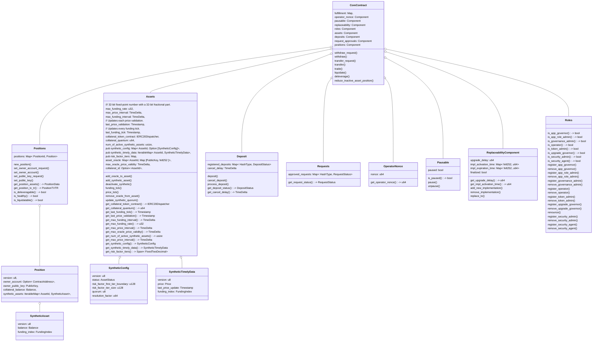

# Perpetuals \- Specs

# Diagrams

## L2 Contracts block diagram



# Core contract

## Value risk calculator

### Total Value (TV) and Total Risk (TR)


[Same as in StarkEx](https://docs.starkware.co/starkex/perpetual/perpetual_overview.html#total_value_total_risk)

The *total value* of a position is the sum of the value of the position’s collateral and synthetic assets, expressed in the collateral currency.
The *total risk* is a measurement that includes the total value of all synthetic assets in a position, and also takes into account a predetermined *risk factor* for each synthetic asset. As the risk factor increases, so does the total risk.
Example:

### Structs

#### PositionTVTR

The total value and total risk of a position.

```rust
pub struct PositionTVTR {
    pub total_value: i128,
    pub total_risk: u128,
}

```

#### TVTRChange

The change in terms of total value and total risk of a position.

```rust
pub struct TVTRChange {
    pub before: PositionTVTR,
    pub after: PositionTVTR,
}
```

#### PositionState

Represents the state of a position based on its total value and total risk.
- A position is **Deleveragable** (and also **Liquidatable**) if its total value is negative.
- A position is **Liquidatable** if its total value is less than its total risk.
- Otherwise, the position is considered **Healthy**.

```rust
pub enum PositionState {
    Healthy,
    Liquidatable,
    Deleveragable,
}
```

#### Deleveragable

A position is in deleveragable state when:
$TV<0 $

#### Liquidatable

A position is in liquidatable state when:
$TV<TR $

#### Healthy

A position is in a healthy state when:
$TV\geq TR $

### Functions

#### Calculate Position TV TR Change

```rust
fn calculate_position_tvtr_change(
    unchanged_assets: UnchangedAssets, position_diff_enriched: PositionDiffEnriched,
) -> TVTRChange
```

##### Logic
1. Calculates value and risk for unchanged assets
2. Calculates value and risk changes for collateral asset
3. Calculates value and risk changes for synthetic assets
4. Combines all calculations into final before/after totals

#### Is Healthier

checks if the change in position is healthier than the previous state.

$$ ( \frac{TV}{TR})\_{new} \geq (\frac{TV}{TR})\_{old} $$

   **AND**

$$ {TR}\_{new} \lt {TR\_{old}} $$

#### Is Fair Deleverage

checks if the deleverage is fair.

$$ \frac{TV\_{new}-1e^{-6}USDC}{TR\_{new}} \leq \frac{TV}{TR}\_{old} \leq \frac{TV}{TR}\_{new} $$

Deleveragerer should be [healthy](#healthy) or [healthier](#is-healthier).
Deleveragree should be ([healthy](#healthy) or [healthier](#is-healthier)) **and** [is fair deleverage](#is-fair-deleverage)


## Structs

### PositionId

```rust
struct PositionId {
    value: u32,
}
```

### AssetId

```rust
pub struct AssetId {
    pub value: felt252,
}
```

### Position

```rust
#[starknet::storage_node]
pub struct Position {
    pub version: u8,
    pub owner_account: Option<ContractAddress>,
    pub owner_public_key: PublicKey,
    pub collateral_balance: Balance,
    pub synthetic_balance: IterableMap<AssetId, SyntheticBalance>,
}
```

### PublicKey

```rust
pub type PublicKey = felt252;
```

### Balance

```rust
pub struct Balance {
    pub value: i64
}
```

### RiskFactor

Risk factor is a value that represents the risk of a synthetic asset.
For each synthetic asset, the risk factor is a value between 0 and 100.
The risk factor is determined by the asset value in the position.

```rust
// Fixed-point decimal with 2 decimal places.
// Example: 0.75 is represented as 75.
pub struct RiskFactor {
    pub value: u8 // Stores number * 100
}
```

### SyntheticAsset

```rust
pub struct SyntheticAsset {
    pub id: AssetId,
    pub balance: Balance,
    pub price: Price,
    pub risk_factor: RiskFactor,
}
```

### PositionData

```rust
pub struct PositionData {
    pub synthetics: Span<SyntheticAsset>,
    pub collateral_balance: Balance,
}
```

### FundingIndex

`FundingIndex` represents a global funding rate tracker for each synthetic asset in the system.
It's used to calculate funding payments between long and short position holders.
To optimize performance, positions are only updated with the latest funding index when their
owners execute transactions. The system then calculates the accumulated funding payment since
the last interaction and adjusts the position's collateral balance accordingly.
After each update, the current funding index is cached for each synthetic asset in the position.

```rust
pub struct FundingIndex {
    /// Signed 64-bit fixed-point number:
    /// 1 sign bit, 31-bits integer part, 32-bits fractional part.
    pub value: i64
}
```

### SyntheticBalance

```rust
pub struct SyntheticBalance {
    pub version: u8,
    pub balance: Balance,
    pub funding_index: FundingIndex,
}

```

### Price
Price is the price of a synthetic asset in the Perps system.
The price is the price of the minimal unit of the asset in 10^-6 USD.
```rust
pub struct Price {
	// Unsigned 28-bit fixed point decimal percision.
    // 28-bit for the integer part and 28-bit for the fractional part.
    pub value: u64
}
```


### SyntheticDiffEnriched

```rust
pub struct SyntheticDiffEnriched {
    pub asset_id: AssetId,
    pub balance_before: Balance,
    pub balance_after: Balance,
    pub price: Price,
    pub risk_factor_before: RiskFactor,
    pub risk_factor_after: RiskFactor,
}
```

### Signature

```rust
pub type Signature = Span<felt252>;
```

### HashType

```rust
pub type HashType = felt252;
```
### Timestamp

```rust
pub struct Timestamp {
    pub seconds: u64
}
```

### TimeDelta

```rust
pub struct TimeDelta {
    pub seconds: u64
}
```


### AssetStatus

```rust
pub enum AssetStatus {
    PENDING,
    ACTIVE,
    INACTIVE,
}
```

### SyntheticConfig

```rust
struct SyntheticConfig {
    version: u8,
    pub status: AssetStatus,
    pub risk_factor_first_tier_boundary: u128,
    pub risk_factor_tier_size: u128,
    pub quorum: u8,
    // Smallest unit of a synthetic asset in the system.
    pub resolution_factor: u64,
}
```

### SyntheticTimelyData

```rust
struct SyntheticTimelyData {
    version: u8,
    pub price: Price,
    pub last_price_update: Timestamp,
    pub funding_index: FundingIndex,
}
```

### FundingTick
In `funding_tick` we get `FundingIndex` for each active synthetic asset in the system.

```rust
pub struct FundingTick {
    asset_id: AssetId,
    funding_index: FundingIndex
}
```

### SignedPrice
In `price_tick` we get an array of `SignedPrice` for a single synthetic asset in the system and then we calculate the price in terms of the system's smallest unit.

```rust
pub struct SignedPrice {
    pub signature: Signature,
    pub signer_public_key: PublicKey,
    pub timestamp: u32,
    pub oracle_price: u128,
}
```
## Validations

### Pause

Checking that the contract is not paused. This is done using pausable component.

### Position

Checking that the position exists in the system.

### Operator Nonce

Checking that the caller of the function is the Operator and checks that the operator nonce received is the same as in the component. This is done using OperatorNonce component.

### Signature

#### Caller validation

When a position has owner account the flows that require 2 phases (deposit, withdraw, transfer and change\_position\_public\_key) we validate that the caller of the request is the owner account.

#### Public key signature

This is done using the [OZ account/src/utils/signature.cairo](https://github.com/OpenZeppelin/cairo-contracts/blob/main/packages/account/src/utils/signature.cairo).


#### Get Message Hash

Hash on the following args are done according to [SNIP-12](https://github.com/starknet-io/SNIPs/blob/main/SNIPS/snip-12.md).

```rust
pub(crate) impl OffchainMessageHashImpl<
    T, +StructHash<T>, impl metadata: SNIP12Metadata,
> of OffchainMessageHash<T> {
    fn get_message_hash(self: @T, public_key: PublicKey) -> HashType {
        let domain = StarknetDomain {
            name: metadata::name(),
            version: metadata::version(),
            chain_id: get_tx_info().unbox().chain_id,
            revision: '1',
        };
        let mut state = PoseidonTrait::new();
        state = state.update_with('StarkNet Message');
        state = state.update_with(domain.hash_struct());
        state = state.update_with(public_key);
        state = state.update_with(self.hash_struct());
        state.finalize()
    }
}
```

The `hash_struct()` is the following:

```rust
fn hash_struct(self: @TYPE) -> HashType {
    let hash_state = PoseidonTrait::new();
    hash_state.update_with(TYPE_HASH).update_with(*self).finalize()
}

```

The `StarknetDomain` values are:


```rust
const NAME: felt252 = 'Perpetuals';
const VERSION: felt252 = 'v0';
```

And the `StarknetDomain` type hash is:

```rust
// selector!(
//   "\"StarknetDomain\"(
//    \"name\":\"shortstring\",
//    \"version\":\"shortstring\",
//    \"chainId\":\"shortstring\",
//    \"revision\":\"shortstring\"
//   )"
// );
pub const STARKNET_DOMAIN_TYPE_HASH: HashType =
    0x1ff2f602e42168014d405a94f75e8a93d640751d71d16311266e140d8b0a210;

```

The public key is the position public key.

##### WithdrawArgs
```rust
pub struct WithdrawArgs {
    pub recipient: ContractAddress,
    pub position_id: PositionId,
    pub collateral_id: AssetId,
    pub amount: u64,
    pub expiration: Timestamp,
    pub salt: felt252,
}

/// selector!(
///   "\"WithdrawArgs\"(
///    \"recipient\":\"ContractAddress\",
///    \"position_id\":\"PositionId\",
///    \"collateral_id\":\"AssetId\",
///    \"amount\":\"u64\",
///    \"expiration\":\"Timestamp\"
///    \"salt\":\"felt\",
///    )
///    \"PositionId\"(
///    \"value\":\"u32\"
///    )"
///    \"AssetId\"(
///    \"value\":\"felt\"
///    )"
///    \"Timestamp\"(
///    \"seconds\":\"u64\"
///    )
/// );
const WITHDRAW_ARGS_TYPE_HASH: HashType =
    0x250a5fa378e8b771654bd43dcb34844534f9d1e29e16b14760d7936ea7f4b1d;

impl StructHashImpl of StructHash<WithdrawArgs> {
    fn hash_struct(self: @WithdrawArgs) -> HashType {
        let hash_state = PoseidonTrait::new();
        hash_state.update_with(WITHDRAW_ARGS_TYPE_HASH).update_with(*self).finalize()
    }
}
```

##### TransferArgs

```rust
pub struct TransferArgs {
    pub recipient: PositionId,
    pub position_id: PositionId,
    pub collateral_id: AssetId,
    pub amount: u64,
    pub expiration: Timestamp,
    pub salt: felt252,
}


/// selector!(
///   "\"TransferArgs\"(
///    \"recipient\":\"PositionId\",
///    \"position_id\":\"PositionId\",
///    \"collateral_id\":\"AssetId\"
///    \"amount\":\"u64\"
///    \"expiration\":\"Timestamp\",
///    \"salt\":\"felt\"
///    )
///    \"PositionId\"(
///    \"value\":\"u32\"
///    )"
///    \"AssetId\"(
///    \"value\":\"felt\"
///    )"
///    \"Timestamp\"(
///    \"seconds\":\"u64\"
///    )
/// );
const TRANSFER_ARGS_TYPE_HASH: HashType =
    0x1db88e2709fdf2c59e651d141c3296a42b209ce770871b40413ea109846a3b4;

impl StructHashImpl of StructHash<TransferArgs> {
    fn hash_struct(self: @TransferArgs) -> HashType {
        let hash_state = PoseidonTrait::new();
        hash_state.update_with(TRANSFER_ARGS_TYPE_HASH).update_with(*self).finalize()
    }
}
```

##### SetPublicKeyArgs

```rust
pub struct SetPublicKeyArgs {
    pub position_id: PositionId,
    pub old_public_key: PublicKey,
    pub new_public_key: PublicKey,
    pub expiration: Timestamp,
}


/// selector!(
///   "\"SetPublicKeyArgs\"(
///    \"position_id\":\"PositionId\",
///    \"old_public_key\":\"felt\",
///    \"new_public_key\":\"felt\",
///    \"expiration\":\"Timestamp\"
///    )
///    \"PositionId\"(
///    \"value\":\"u32\"
///    )"
///    \"Timestamp\"(
///    \"seconds\":\"u64\"
///    )
/// );
const SET_PUBLIC_KEY_ARGS_HASH: HashType =
    0x95737230c7eeb47c10a450cdb69cfe565a1f0da2bc7402a701cda82be14e36;

impl StructHashImpl of StructHash<SetPublicKeyArgs> {
    fn hash_struct(self: @SetPublicKeyArgs) -> HashType {
        let hash_state = PoseidonTrait::new();
        hash_state.update_with(SET_PUBLIC_KEY_ARGS_HASH).update_with(*self).finalize()
    }
}
```

##### SetOwnerAccountArgs

```rust
pub struct SetOwnerAccountArgs {
    pub position_id: PositionId,
    pub public_key: PublicKey,
    pub new_owner_account: ContractAddress,
    pub expiration: Timestamp,
}


/// selector!(
///   "\"SetOwnerAccountArgs\"(
///    \"position_id\":\"PositionId\",
///    \"public_key\":\"felt\",
///    \"new_owner_account\":\"ContractAddress\",
///    \"expiration\":\"Timestamp\"
///    )
///    \"PositionId\"(
///    \"value\":\"u32\"
///    )"
///    \"Timestamp\"(
///    \"seconds\":\"u64\"
///    )
/// );
const SET_OWNER_ACCOUNT_ARGS_HASH: HashType =
    0x02c897e00cdbfcfefe21b980feb2bf084673bba0020c809eeecd810c2cf97cfd;

impl StructHashImpl of StructHash<SetOwnerAccountArgs> {
    fn hash_struct(self: @SetOwnerAccountArgs) -> HashType {
        let hash_state = PoseidonTrait::new();
        hash_state.update_with(SET_OWNER_ACCOUNT_ARGS_HASH).update_with(*self).finalize()
    }
}

```

##### Order

```rust
pub struct Order {
    pub position_id: PositionId,
    pub base_asset_id: AssetId,
    pub base_amount: i64,
    pub quote_asset_id: AssetId,
    pub quote_amount: i64,
    pub fee_asset_id: AssetId,
    pub fee_amount: u64,
    pub expiration: Timestamp,
    pub salt: felt252,
}

/// selector!(
///   "\"Order\"(
///    \"position_id\":\"PositionId\",
///    \"base_asset_id\":\"AssetId\",
///    \"base_amount\":\"i64\",
///    \"quote_asset_id\":\"AssetId\",
///    \"quote_amount\":\"i64\",
///    \"fee_asset_id\":\"AssetId\",
///    \"fee_amount\":\"u64\",
///    \"expiration\":\"Timestamp\",
///    \"salt\":\"felt\"
///    )
///    \"PositionId\"(
///    \"value\":\"u32\"
///    )"
///    \"AssetId\"(
///    \"value\":\"felt\"
///    )"
///    \"Timestamp\"(
///    \"seconds\":\"u64\"
///    )
/// );

const ORDER_TYPE_HASH: HashType = 0x36da8d51815527cabfaa9c982f564c80fa7429616739306036f1f9b608dd112;

impl StructHashImpl of StructHash<Order> {
    fn hash_struct(self: @Order) -> HashType {
        let hash_state = PoseidonTrait::new();
        hash_state.update_with(ORDER_TYPE_HASH).update_with(*self).finalize()
    }
}

```

### Expiration

Checking that the expiration timestamp of the transaction hasn’t expired.


### Requests

Checking if there’s an approved request in the [requests component](#requests) ([deposit component](#deposit)) for the current (deposit) flow.

### Funding

At the start of each flow, we check if `max_funding_interval` has passed since the `last_funding_tick`.

### Price

At the start of each flow, we check if `max_price_interval` has passed since the `last_price_validation`.
When this condition is met, we iterate through all active synthetic assets in the system and verify if the `max_price_interval` has elapsed since each asset's `last_price_update`. Following this verification, we update the `last_price_validation` timestamp.

### Asset

Checking that the asset exists in the system and is active.

### Fulfillment

Check whether the order hasn’t already been completely fulfilled by checking whether the fulfillment storage map value of the message hash is smaller than the order base amount.

### Fundamental

Position after the change is [healthy](#healthy) or [is healthier](#is-healthier) after change.

## Errors

```rust
pub const CANT_TRADE_WITH_FEE_POSITION: felt252 = 'CANT_TRADE_WITH_FEE_POSITION';
pub const CANT_LIQUIDATE_IF_POSITION: felt252 = 'CANT_LIQUIDATE_IF_POSITION';
pub const DIFFERENT_BASE_ASSET_IDS: felt252 = 'DIFFERENT_BASE_ASSET_IDS';
pub const QUOTE_ASSET_ID_NOT_COLLATERAL: felt252 = 'QUOTE_ASSET_ID_NOT_COLLATERAL';
pub const FEE_ASSET_AMOUNT_MISMATCH: felt252 = 'FEE_ASSET_AMOUNT_MISMATCH';
pub const INVALID_ACTUAL_BASE_SIGN: felt252 = 'INVALID_ACTUAL_BASE_SIGN';
pub const INVALID_ACTUAL_QUOTE_SIGN: felt252 = 'INVALID_ACTUAL_QUOTE_SIGN';
pub const INVALID_AMOUNT_SIGN: felt252 = 'INVALID_AMOUNT_SIGN';
pub const INVALID_BASE_CHANGE: felt252 = 'INVALID_BASE_CHANGE';
pub const INVALID_NON_SYNTHETIC_ASSET: felt252 = 'INVALID_NON_SYNTHETIC_ASSET';
pub const INVALID_OWNER_SIGNATURE: felt252 = 'INVALID_ACCOUNT_OWNER_SIGNATURE';
pub const INVALID_QUOTE_AMOUNT_SIGN: felt252 = 'INVALID_QUOTE_AMOUNT_SIGN';
pub const INVALID_SAME_POSITIONS: felt252 = 'INVALID_SAME_POSITIONS';
pub const INVALID_ZERO_AMOUNT: felt252 = 'INVALID_ZERO_AMOUNT';
pub const POSITION_UNHEALTHY: felt252 = 'POSITION_UNHEALTHY';
pub const SAME_BASE_QUOTE_ASSET_IDS: felt252 = 'SAME_BASE_QUOTE_ASSET_IDS';
pub const TRANSFER_EXPIRED: felt252 = 'TRANSFER_EXPIRED';
pub const WITHDRAW_EXPIRED: felt252 = 'WITHDRAW_EXPIRED';

pub fn fulfillment_exceeded_err(position_id: PositionId) -> ByteArray {
    format!("FULFILLMENT_EXCEEDED position_id: {:?}", position_id)
}

pub fn illegal_base_to_quote_ratio_err(position_id: PositionId) -> ByteArray {
    format!("ILLEGAL_BASE_TO_QUOTE_RATIO position_id: {:?}", position_id)
}

pub fn illegal_fee_to_quote_ratio_err(position_id: PositionId) -> ByteArray {
    format!("ILLEGAL_FEE_TO_QUOTE_RATIO position_id: {:?}", position_id)
}

pub fn illegal_zero_fee() -> ByteArray {
    format!("NON_ZERO_FEE_IN_LIQUIDATE_INSURANCE_FUND")
}

pub fn invalid_funding_rate_err(synthetic_id: AssetId) -> ByteArray {
    format!("INVALID_FUNDING_RATE synthetic_id: {:?}", synthetic_id)
}

pub fn order_expired_err(position_id: PositionId) -> ByteArray {
    format!("ORDER_EXPIRED position_id: {:?}", position_id)
}

pub fn position_not_deleveragable(position_id: PositionId) -> ByteArray {
    format!("POSITION_IS_NOT_DELEVERAGABLE position_id: {:?}", position_id)
}

pub fn position_not_fair_deleverage(position_id: PositionId) -> ByteArray {
    format!("POSITION_IS_NOT_FAIR_DELEVERAGE position_id: {:?}", position_id)
}

pub fn position_not_healthy_nor_healthier(position_id: PositionId) -> ByteArray {
    format!("POSITION_NOT_HEALTHY_NOR_HEALTHIER position_id: {:?}", position_id)
}

pub fn position_not_liquidatable(position_id: PositionId) -> ByteArray {
    format!("POSITION_IS_NOT_LIQUIDATABLE position_id: {:?}", position_id)
}
```

## Components

### Operator Nonce
A component for operator flows - checks that the nonce is valid and that the Operator is the caller.

#### Interface

```rust
#[starknet::interface]
pub trait IOperatorNonce<TContractState> {
    fn get_operator_nonce(self: @TContractState) -> u64;
}
```
#### Storage
```rust
#[storage]
pub struct Storage {
    nonce: u64,
}
```

### Pausable

A security component for the pause mechanism.

#### Interface

```rust
#[starknet::interface]
pub trait IPausable<TState> {
    fn is_paused(self: @TState) -> bool;
    fn pause(ref self: TState);
    fn unpause(ref self: TState);
}
```
#### Storage
```rust
#[storage]
pub struct Storage {
    pub paused: bool,
}
```
#### Events
```rust
pub enum Event {
    Paused: Paused,
    Unpaused: Unpaused,
}
```
### Replaceability

In charge of the upgrades of the contract
#### Interface

```rust
#[starknet::interface]
pub trait IReplaceable<TContractState> {
    fn get_upgrade_delay(self: @TContractState) -> u64;
    fn get_impl_activation_time(
        self: @TContractState, implementation_data: ImplementationData,
    ) -> u64;
    fn add_new_implementation(ref self: TContractState, implementation_data: ImplementationData);
    fn remove_implementation(ref self: TContractState, implementation_data: ImplementationData);
    fn replace_to(ref self: TContractState, implementation_data: ImplementationData);
}
```
#### Storage
```rust
    #[storage]
    struct Storage {
        // Delay in seconds before performing an upgrade.
        upgrade_delay: u64,
        // Timestamp by which implementation can be activated.
        impl_activation_time: Map<felt252, u64>,
        // Timestamp until which implementation can be activated.
        impl_expiration_time: Map<felt252, u64>,
        // Is the implementation finalized.
        finalized: bool,
    }
```
#### Events
```rust
pub enum Event {
    ImplementationAdded: ImplementationAdded,
    ImplementationRemoved: ImplementationRemoved,
    ImplementationReplaced: ImplementationReplaced,
    ImplementationFinalized: ImplementationFinalized,
}
```

### Requests

A component for registration of user requests and validation. The component allows users request the following flows: `transfer_request`, `withdraw_request`, `set_public_key_request` and `set_owner_account_request` before the operator can execute them.

#### Interface

```rust
#[starknet::interface]
pub trait IRequestApprovals<TContractState> {
    /// Returns the status of a request.
    fn get_request_status(self: @TContractState, request_hash: HashType) -> RequestStatus;
}

pub enum RequestStatus {
    #[default]
    NOT_REGISTERED,
    PROCESSED,
    PENDING,
}
```

#### Storage

```rust
#[storage]
pub struct Storage {
    approved_requests: Map<HashType, RequestStatus>,
}
```

#### Errors

```rust
pub const CALLER_IS_NOT_OWNER_ACCOUNT: felt252 = 'CALLER_IS_NOT_OWNER_ACCOUNT';
pub const REQUEST_ALREADY_PROCESSED: felt252 = 'REQUEST_ALREADY_PROCESSED';
pub const REQUEST_ALREADY_REGISTERED: felt252 = 'REQUEST_ALREADY_REGISTERED';
pub const REQUEST_NOT_REGISTERED: felt252 = 'REQUEST_NOT_REGISTERED';
```

### Roles

In charge of access control in the contract.

#### Interface

```rust
#[starknet::interface]
pub trait IRoles<TContractState> {
    fn is_app_governor(self: @TContractState, account: ContractAddress) -> bool;
    fn is_app_role_admin(self: @TContractState, account: ContractAddress) -> bool;
    fn is_governance_admin(self: @TContractState, account: ContractAddress) -> bool;
    fn is_operator(self: @TContractState, account: ContractAddress) -> bool;
    fn is_token_admin(self: @TContractState, account: ContractAddress) -> bool;
    fn is_upgrade_governor(self: @TContractState, account: ContractAddress) -> bool;
    fn is_security_admin(self: @TContractState, account: ContractAddress) -> bool;
    fn is_security_agent(self: @TContractState, account: ContractAddress) -> bool;
    fn register_app_governor(ref self: TContractState, account: ContractAddress);
    fn remove_app_governor(ref self: TContractState, account: ContractAddress);
    fn register_app_role_admin(ref self: TContractState, account: ContractAddress);
    fn remove_app_role_admin(ref self: TContractState, account: ContractAddress);
    fn register_governance_admin(ref self: TContractState, account: ContractAddress);
    fn remove_governance_admin(ref self: TContractState, account: ContractAddress);
    fn register_operator(ref self: TContractState, account: ContractAddress);
    fn remove_operator(ref self: TContractState, account: ContractAddress);
    fn register_token_admin(ref self: TContractState, account: ContractAddress);
    fn remove_token_admin(ref self: TContractState, account: ContractAddress);
    fn register_upgrade_governor(ref self: TContractState, account: ContractAddress);
    fn remove_upgrade_governor(ref self: TContractState, account: ContractAddress);
    fn renounce(ref self: TContractState, role: RoleId);
    fn register_security_admin(ref self: TContractState, account: ContractAddress);
    fn remove_security_admin(ref self: TContractState, account: ContractAddress);
    fn register_security_agent(ref self: TContractState, account: ContractAddress);
    fn remove_security_agent(ref self: TContractState, account: ContractAddress);
}
```
#### Events
```rust
pub enum Event {
    AppGovernorAdded: AppGovernorAdded,
    AppGovernorRemoved: AppGovernorRemoved,
    AppRoleAdminAdded: AppRoleAdminAdded,
    AppRoleAdminRemoved: AppRoleAdminRemoved,
    GovernanceAdminAdded: GovernanceAdminAdded,
    GovernanceAdminRemoved: GovernanceAdminRemoved,
    OperatorAdded: OperatorAdded,
    OperatorRemoved: OperatorRemoved,
    SecurityAdminAdded: SecurityAdminAdded,
    SecurityAdminRemoved: SecurityAdminRemoved,
    SecurityAgentAdded: SecurityAgentAdded,
    SecurityAgentRemoved: SecurityAgentRemoved,
    TokenAdminAdded: TokenAdminAdded,
    TokenAdminRemoved: TokenAdminRemoved,
    UpgradeGovernorAdded: UpgradeGovernorAdded,
    UpgradeGovernorRemoved: UpgradeGovernorRemoved,
}
```

#### Errors

```rust
pub(crate) enum AccessErrors {
    INVALID_MINTER,
    INVALID_TOKEN,
    CALLER_MISSING_ROLE,
    ZERO_ADDRESS,
    ALREADY_INITIALIZED,
    ZERO_ADDRESS_GOV_ADMIN,
    ONLY_APP_GOVERNOR,
    ONLY_OPERATOR,
    ONLY_TOKEN_ADMIN,
    ONLY_UPGRADE_GOVERNOR,
    ONLY_SECURITY_ADMIN,
    ONLY_SECURITY_AGENT,
    ONLY_MINTER,
    ONLY_SELF_CAN_RENOUNCE,
    GOV_ADMIN_CANNOT_RENOUNCE,
    MISSING_ROLE,
}
```

### Assets

In charge of all assets related operations.

#### Storage

```rust
#[storage]
pub struct Storage {
    /// 32-bit fixed-point number with a 32-bit fractional part.
    max_funding_rate: u32,
    max_price_interval: TimeDelta,
    max_funding_interval: TimeDelta,
    // Updates each price validation.
    last_price_validation: Timestamp,
    // Updates every funding tick.
    last_funding_tick: Timestamp,
    collateral_token_contract: IERC20Dispatcher,
    collateral_quantum: u64,
    num_of_active_synthetic_assets: usize,
    pub synthetic_config: Map<AssetId, Option<SyntheticConfig>>,
    pub synthetic_timely_data: IterableMap<AssetId, SyntheticTimelyData>,
    pub risk_factor_tiers: Map<AssetId, Vec<FixedTwoDecimal>>,
    asset_oracle: Map<AssetId, Map<PublicKey, felt252>>,
    max_oracle_price_validity: TimeDelta,
    collateral_id: Option<AssetId>,
}

```
#### Events

```rust
#[event]
pub enum Event {
    OracleAdded: events::OracleAdded,
    SyntheticAdded: events::SyntheticAdded,
    AssetActivated: events::AssetActivated,
    SyntheticAssetDeactivated: events::SyntheticAssetDeactivated,
    FundingTick: events::FundingTick,
    PriceTick: events::PriceTick,
    OracleRemoved: events::OracleRemoved,
    AssetQuorumUpdated: events::AssetQuorumUpdated,
}
```

##### FundingTick

```rust
#[derive(Debug, Drop, PartialEq, starknet::Event)]
pub struct FundingTick {
    #[key]
    pub asset_id: AssetId,
    pub funding_index: FundingIndex,
}
```

##### PriceTick

```rust
#[derive(Debug, Drop, PartialEq, starknet::Event)]
pub struct PriceTick {
    #[key]
    pub asset_id: AssetId,
    pub price: Price,
}
```

##### AssetActivated
```rust
#[derive(Debug, Drop, PartialEq, starknet::Event)]
pub struct AssetActivated {
    #[key]
    pub asset_id: AssetId,
}
```

##### SyntheticAdded

```rust
#[derive(Debug, Drop, PartialEq, starknet::Event)]
pub struct SyntheticAdded {
    #[key]
    pub asset_id: AssetId,
    pub risk_factor_tiers: Span<u8>,
    pub risk_factor_first_tier_boundary: u128,
    pub risk_factor_tier_size: u128,
    pub resolution_factor: u64,
    pub quorum: u8,
}
```

##### SyntheticAssetDeactivated

```rust
#[derive(Debug, Drop, PartialEq, starknet::Event)]
pub struct SyntheticAssetDeactivated {
    #[key]
    pub asset_id: AssetId,
}
```

##### AssetQuorumUpdated

```rust
#[derive(Debug, Drop, PartialEq, starknet::Event)]
pub struct AssetQuorumUpdated {
    #[key]
    pub asset_id: AssetId,
    pub new_quorum: u8,
    pub old_quorum: u8,
}
```

##### OracleRemoved

```rust
#[derive(Debug, Drop, PartialEq, starknet::Event)]
pub struct OracleRemoved {
    #[key]
    pub asset_id: AssetId,
    #[key]
    pub oracle_public_key: PublicKey,
}
```

##### OracleAdded
```rust
#[derive(Debug, Drop, PartialEq, starknet::Event)]
pub struct OracleAdded {
    #[key]
    pub asset_id: AssetId,
    pub asset_name: felt252,
    #[key]
    pub oracle_public_key: PublicKey,
    pub oracle_name: felt252,
}
```

#### Public Functions

##### Funding Tick

###### Description

Updates the funding index of every active, and non-pending, asset in the system.
**`funding_ticks` span must be sorted according to the asset id**

```rust
fn funding_tick(
    ref self: ContractState,
    operator_nonce: u64,
    funding_ticks: Span<FundingTick>,
)
```

Funding is calculated on the go and applied during any flow that requires checking the collateral balance. This calculation is done without updating the storage. When updating a position's synthetic assets, the following steps are taken:

When the funding index increases over time:
- Long positions (positive balance) pay funding (negative result)
- Short positions (negative balance) receive funding (positive result)
When the funding index decreases over time:
- Long positions receive funding (positive result)
- Short positions pay funding (negative result)
This is why we subtract the new index from the old index in the calculation,
to ensure the correct direction of payment based on position type.

1. Update the collateral balance based on the funding amount:

   $$change=(old\\_funding\\_index - new\\_funding\\_index)*balance $$

Add `change` to the collateral balance (notice that `change` can be positive or negative)

2. Update the cached\_funding\_index of the synthetic asset
3. Update the synthetic balance.

###### Access Control

Only the Operator can execute.

###### Validations

1. [Pausable check](#pausable)
2. [Operator Nonce check](#operator-nonce)
3. funding ticks len equals to `num_of_active_synthetic_assets`.
4. assets are sorted in ascending order \- no duplicates.
5. **max\_funding\_rate validation**:
   For **one** time unit, the following should be held: $\frac{prev - new}{price} \leq \\%permitted $
   In practice, we would check:
   $prev\\_idx-new\\_idx \leq max\\_funding\\_rate * (block\\_timestamp-prev\\_funding\\_time) * asset\\_price$

###### Logic

1. Run Validations
2. Iterate over the funding ticks:
   1. Update asset funding index if asset is active else panic.
   2. prev\_asset\_id \= curr\_tick.asset\_id
3. Update global last\_funding\_tick timestamp in storage

###### Errors
- PAUSED
- INVALID\_NONCE
- ONLY\_OPERATOR
- INVALID\_FUNDING\_TICK\_LEN
- FUNDING_TICKS_NOT_SORTED
- SYNTHETIC_NOT_EXISTS
- SYNTHETIC\_NOT\_ACTIVE
- NOT_SYNTHETIC
- INVALID_FUNDING_RATE

###### Emits

For each element in `funding_ticks`: [FundingTick](#fundingtick-1)

##### Price Tick

###### Description

Price tick for an asset to update its’ price.
**price\_tick span must be sorted according to the signers public keys**

```rust
fn price_tick(
    ref self: ComponentState<TContractState>,
    operator_nonce: u64,
    asset_id: AssetId,
    oracle_price: u128,
    signed_prices: Span<SignedPrice>,
)
```

###### Access Control

Only the Operator can execute.

###### Validations

1. [Pausable check](#pausable)
2. [Operator Nonce check](#operator-nonce)
3. Timestamps are at most `max_oracle_price_validity`
4. `signed_prices` length >= synthetic_config[asset_id].quorum
5. `signed_prices` is sorted according to the signers public key
6. Validate that the `oracle_price` is actually the median price (odd: the middle; even: between middles)

###### Logic

1. For each `signed_price` in `signed_prices`:
   1. Validate stark signature on:
      `pedersen(`
&nbsp;&nbsp;&nbsp;&nbsp;`oracles[signed_price.signer_public_key],`
&nbsp;&nbsp;&nbsp;&nbsp;`0...0(100 bits) || signed_price.price(120 bits) || signed_price.timestamp (32 bits)`
      `)`
2. calculate median price using the formula:
$median\\_price = \frac{price*2^{28}}{asset\\_id.resolution\\_factor *10^{12} }$
3. `self.synthetic_timely_data[asset_id].price = median_price`

   Explanation: Oracles sign prices in the same format as StarkEx \- they sign process of major unit with 18 decimals precision. So to ge the asset price of 1 Starknet unit of synthetic asset:

   $SN\\_asset\\_price=\frac{oracle\\_asset\\_price*2^{28}}{resolution\\_factor *10^{12} }$

   $2^{28}: \text{price has\ 28-bit\ precision}$

   $10^{12}: \text{converting\ 18\ decimals\ to\ 6\ USDC\ decimals}$

4. Update synthetic last price update to current timestamp.
5. if asset_id is not active:
   1. Set asset_id status = AssetStatus::ACTIVATED
   2. num_of_active_synthetic_asset+=1
   3. Emit AssetActivated

###### Emits

[PriceTick](#pricetick-1)
[AssetActivated](#assetactivated)

###### Errors
- PAUSED
- ONLY_OPERATOR
- INVALID_NONCE
- SYNTHETIC_NOT_EXISTS
- QUORUM_NOT_REACHED
- INVALID_STARK_KEY_SIGNATURE
- SIGNED_PRICES_UNSORTED
- INVALID_MEDIAN
- INVALID_PRICE_TIMESTAMP

##### Add Synthetic Asset

###### Description

Adds a synthetic asset.

Risk factor tiers example:
**risk\_factor\_tiers \= \[1, 2, 3, 5, 10, 20, 40\]**
**risk\_factor\_first\_tier\_boundary \= 10,000**
**risk\_factor\_tier\_size \= 20,000**
which means:

- 0 \- 10,000 \-\> 1%
- 10,000 \- 30,000 \-\> 2%
- 30,000 \- 50,000 \-\> 3%
- 50,000 \- 70,000 \-\> 5%
- 70,000 \- 90,000 \-\> 10%
- 90,000 \- 110,000 \-\> 20%
- 110,000+ \-\> 40%

```rust
fn add_synthetic_asset(
    ref self: ContractState,
    asset_id: AssetId,
    risk_factor_tiers: Span<u8>,
    risk_factor_first_tier_boundary: u128,
    risk_factor_tier_size: u128,
    quorum: u8,
    resolution_factor: u64,
)
```

###### Access Control

Only APP\_GOVERNOR can execute.

###### Validations

1. App governor is the caller.
2. asset\_id does not exist in the system.
3. `risk_factor_tiers` length is non zero.
4. `risk_factor_first_tier_boundary`, `risk_factor_tier_size`, `quorum`, and `resolution_factor` are non zero.
5. All values in $0 \leq risk\\_factor\\_tiers \leq 100$ .
6. `risk_factor_tiers` is sorted.


###### Logic

1. Run [validations](#validations-22).
2. Add a new entry to synthetic\_config with the params:
3. Initialize status \= AssetStatus::PENDING. It will be updated during the next price tick of this asset.
4. Add a new entry to synthetic\_timely\_data map with:
   1. price = 0.
   2. funding\_index = 0.
   3. last\_price\_update = Zero::zero().
4. Add the `risk_factor_tiers` to the assets risk\_factor map.

###### Emits

[SyntheticAdded](#syntheticadded)

###### Errors
- ONLY_APP_GOVERNOR
- SYNTHETIC_ALREADY_EXISTS
- INVALID_ZERO_QUORUM

##### Deactivate Synthetic

###### Description

Deactivate synthetic asset.

```rust
fn deactivate_synthetic(
    ref ContractState,
    synthetic_id: AssetId,
)
```

###### Access Control

Only the App governor can execute.

###### Validations

1. App governor is the caller.
2. [Asset](#asset) check.

###### Logic

1. Update synthetic status to AssetStatus::INACTIVE.
2. Decrement num_of_active_synthetic_assets.

###### Emits

[SyntheticAssetDeactivated](#syntheticassetdeactivated)

###### Errors
- ONLY_APP_GOVERNOR
- SYNTHETIC_NOT_EXISTS


##### Add Oracle To Asset

###### Description

```rust
fn add_oracle_to_asset(
    ref ContractState,
    asset_id: AssetId,
    oracle_public_key: PublicKey
    oracle_name: felt252,
    asset_name: felt252,
)
```

###### Access Control

Only APP\_GOVERNOR can execute.

###### Validations

1. App Governor is the caller.
2. `oracle_public_key` does not exist in the `asset_oracle` map.
3. check inputs are non-zero: `asset_id`, `oracle_public_key`, `oracle_name`, and `asset_name`.
4. `asset_name` is 128 bits
5. `oracle_name` is 40 bits


###### Logic

1. Run validations
2. `shifted_asset_name = TWO_POW_40 * asset_name`
3. Add `oracle_public_key` as the key to `shifted_asset_name || oracle_name` into the inner `asset_id` map of `asset_oracle`.

###### Emits

[OracleAdded](#oracleadded)

###### Errors
- ONLY\_APP\_GOVERNOR
- ORACLE_ALREADY_EXISTS
- ORACLE_NAME_TOO_LONG
- ASSET_NAME_TOO_LONG

##### Remove Oracle

###### Description

```rust
fn remove_oracle_from_asset(
    ref ContractState,
    asset_id: AssetId,
    oracle_public_key: PublicKey
)
```

###### Access Control

Only APP\_GOVERNOR can execute.

###### Validations

1. App Governor is the caller.
2. `oracle_public_key` exist in the `asset_id` inner map of `asset_oracle`.

###### Logic

1. Run validations
2. Remove `oracle_public_key` from the `asset_id` inner map of `asset_oracle`.

###### Emits

[OracleRemoved](#oracleremoved)

###### Errors
- ONLY\_APP\_GOVERNOR
- ORACLE_NOT_EXISTS

##### Update Synthetic Quorum

###### Description

```rust
fn update_synthetic_quorum(
    self: ContractState,
    synthetic_id: AssetId,
    quorum: u8
)
```

###### Access Control

Only APP\_GOVERNOR can execute.

###### Validations

1. App Governor is the caller.
2. `quorum` is non zero.
3. [Asset](#asset) check \- `synthetic_id` is not inactive.

###### Logic

1. Run validations
2. Update `quorum` of the `synthetic_id` config.

###### Emits

[AssetQuorumUpdated](#assetquorumupdated)

###### Errors
- ONLY\_APP\_GOVERNOR
- SYNTHETIC_NOT_EXISTS
- SYNTHETIC_NOT_ACTIVE
- INVALID_ZERO_QUORUM
- INVALID_SAME_QUORUM

#### Errors
```rust
pub const ALREADY_INITIALIZED: felt252 = 'ALREADY_INITIALIZED';
pub const ASSET_ALREADY_EXISTS: felt252 = 'ASSET_ALREADY_EXISTS';
pub const ASSET_NAME_TOO_LONG: felt252 = 'ASSET_NAME_TOO_LONG';
pub const ASSET_NOT_ACTIVE: felt252 = 'ASSET_NOT_ACTIVE';
pub const ASSET_NOT_EXISTS: felt252 = 'ASSET_NOT_EXISTS';
pub const ASSET_REGISTERED_AS_COLLATERAL: felt252 = 'ASSET_REGISTERED_AS_COLLATERAL';
pub const COLLATERAL_NOT_EXISTS: felt252 = 'COLLATERAL_NOT_EXISTS';
pub const COLLATERAL_NOT_REGISTERED: felt252 = 'COLLATERAL_NOT_REGISTERED';
pub const INACTIVE_ASSET: felt252 = 'INACTIVE_ASSET';
pub const FUNDING_EXPIRED: felt252 = 'FUNDING_EXPIRED';
pub const FUNDING_TICKS_NOT_SORTED: felt252 = 'FUNDING_TICKS_NOT_SORTED';
pub const INVALID_FUNDING_TICK_LEN: felt252 = 'INVALID_FUNDING_TICK_LEN';
pub const INVALID_MEDIAN: felt252 = 'INVALID_MEDIAN';
pub const INVALID_PRICE_TIMESTAMP: felt252 = 'INVALID_PRICE_TIMESTAMP';
pub const INVALID_SAME_QUORUM: felt252 = 'INVALID_SAME_QUORUM';
pub const INVALID_STATUS: felt252 = 'INVALID_STATUS';
pub const INVALID_ZERO_TOKEN_ADDRESS: felt252 = 'INVALID_ZERO_TOKEN_ADDRESS';
pub const INVALID_ZERO_QUANTUM: felt252 = 'INVALID_ZERO_QUANTUM';
pub const INVALID_ZERO_ASSET_ID: felt252 = 'INVALID_ZERO_ASSET_ID';
pub const INVALID_ZERO_ASSET_NAME: felt252 = 'INVALID_ZERO_ASSET_NAME';
pub const INVALID_ZERO_ORACLE_NAME: felt252 = 'INVALID_ZERO_ORACLE_NAME';
pub const INVALID_ZERO_PUBLIC_KEY: felt252 = 'INVALID_ZERO_PUBLIC_KEY';
pub const INVALID_ZERO_QUORUM: felt252 = 'INVALID_ZERO_QUORUM';
pub const INVALID_ZERO_RESOLUTION_FACTOR: felt252 = 'INVALID_ZERO_RESOLUTION_FACTOR';
pub const INVALID_ZERO_RF_FIRST_BOUNDRY: felt252 = 'INVALID_ZERO_RF_FIRST_BOUNDRY';
pub const INVALID_ZERO_RF_TIER_SIZE: felt252 = 'INVALID_ZERO_RF_TIER_SIZE';
pub const INVALID_ZERO_RF_TIERS_LEN: felt252 = 'INVALID_ZERO_RF_TIERS_LEN';
pub const NOT_COLLATERAL: felt252 = 'NOT_COLLATERAL';
pub const NOT_SYNTHETIC: felt252 = 'NOT_SYNTHETIC';
pub const ORACLE_ALREADY_EXISTS: felt252 = 'ORACLE_ALREADY_EXISTS';
pub const ORACLE_NOT_EXISTS: felt252 = 'ORACLE_NOT_EXISTS';
pub const ORACLE_NAME_TOO_LONG: felt252 = 'ORACLE_NAME_TOO_LONG';
pub const QUORUM_NOT_REACHED: felt252 = 'QUORUM_NOT_REACHED';
pub const SIGNED_PRICES_UNSORTED: felt252 = 'SIGNED_PRICES_UNSORTED';
pub const SYNTHETIC_ALREADY_EXISTS: felt252 = 'SYNTHETIC_ALREADY_EXISTS';
pub const SYNTHETIC_EXPIRED_PRICE: felt252 = 'SYNTHETIC_EXPIRED_PRICE';
pub const SYNTHETIC_NOT_ACTIVE: felt252 = 'SYNTHETIC_NOT_ACTIVE';
pub const SYNTHETIC_NOT_EXISTS: felt252 = 'SYNTHETIC_NOT_EXISTS';
pub const UNSORTED_RISK_FACTOR_TIERS: felt252 = 'UNSORTED_RISK_FACTOR_TIERS';
pub const ZERO_MAX_PRICE_INTERVAL: felt252 = 'ZERO_MAX_PRICE_INTERVAL';
pub const ZERO_MAX_FUNDING_INTERVAL: felt252 = 'ZERO_MAX_FUNDING_INTERVAL';
pub const ZERO_MAX_FUNDING_RATE: felt252 = 'ZERO_MAX_FUNDING_RATE';
pub const ZERO_MAX_ORACLE_PRICE: felt252 = 'ZERO_MAX_ORACLE_PRICE';
```

### Deposit

A component for handling deposits.

#### Structs

##### DepositStatus

```rust
pub enum DepositStatus {
    #[default]
    NOT_REGISTERED,
    PROCESSED,
    CANCELED,
    PENDING: Timestamp,
}
```

#### Storage

```rust
#[storage]
pub struct Storage {
    registered_deposits: Map<HashType, DepositStatus>,
    cancel_delay: TimeDelta,
}
```
#### Events
```rust
#[event]
#[derive(Drop, PartialEq, starknet::Event)]
pub enum Event {
    Deposit: events::Deposit,
    DepositCanceled: events::DepositCanceled,
    DepositProcessed: events::DepositProcessed,
}
```

##### Deposit
```rust
#[derive(Debug, Drop, PartialEq, starknet::Event)]
pub struct Deposit {
    #[key]
    pub position_id: PositionId,
    #[key]
    pub depositing_address: ContractAddress,
    pub collateral_id: AssetId,
    pub quantized_amount: u64,
    pub unquantized_amount: u64,
    #[key]
    pub deposit_request_hash: felt252,
}
```

##### DepositProcessed
```rust
#[derive(Debug, Drop, PartialEq, starknet::Event)]
pub struct DepositProcessed {
    #[key]
    pub position_id: PositionId,
    #[key]
    pub depositing_address: ContractAddress,
    pub collateral_id: AssetId,
    pub quantized_amount: u64,
    pub unquantized_amount: u64,
    #[key]
    pub deposit_request_hash: felt252,
}
```

##### DepositCanceled

```rust
#[derive(Debug, Drop, PartialEq, starknet::Event)]
pub struct DepositCanceled {
    #[key]
    pub position_id: PositionId,
    #[key]
    pub depositing_address: ContractAddress,
    pub collateral_id: AssetId,
    pub quantized_amount: u64,
    pub unquantized_amount: u64,
    #[key]
    pub deposit_request_hash: felt252,
}
```

#### Errors
```rust
pub const ALREADY_INITIALIZED: felt252 = 'ALREADY_INITIALIZED';
pub const CANCELLETION_TIME_PASSED: felt252 = 'CANCELLETION_TIME_PASSED';
pub const DEPOSIT_ALREADY_CANCELED: felt252 = 'DEPOSIT_ALREADY_CANCELED';
pub const DEPOSIT_ALREADY_PROCESSED: felt252 = 'DEPOSIT_ALREADY_PROCESSED';
pub const DEPOSIT_ALREADY_REGISTERED: felt252 = 'DEPOSIT_ALREADY_REGISTERED';
pub const DEPOSIT_NOT_CANCELABLE: felt252 = 'DEPOSIT_NOT_CANCELABLE';
pub const DEPOSIT_NOT_REGISTERED: felt252 = 'DEPOSIT_NOT_REGISTERED';
pub const INVALID_CANCEL_DELAY: felt252 = 'INVALID_CANCEL_DELAY';
pub const ZERO_AMOUNT: felt252 = 'ZERO_AMOUNT';
```

#### Public Functions

##### Deposit

###### Description

The user registers a deposit request using the [Deposit component](#deposit) \- this happens in the Deposit component.

```rust
fn deposit(
	ref self: ContractState,
    position_id: PositionId,
    quantized_amount: u64,
    salt: felt252,
)
```

###### Access Control

Anyone can execute.

###### Hash

```rust
pub fn deposit_hash(
    token_address: ContractAddress,
    depositor: ContractAddress,
    position_id: PositionId,
    quantized_amount: u64,
    salt: felt252,
) -> HashType {
    PedersenTrait::new(base: token_address.into())
        .update_with(value: depositor)
        .update_with(value: position_id)
        .update_with(value: quantized_amount)
        .update_with(value: salt)
        .finalize()
}

```

###### Validations

1. `quantized_amount` is non zero.
2. `deposit_hash` is not registered in `registered_deposits`.

###### Logic

1. Register `deposit_hash` as `DepositStatus::PENDING` in `registered_deposits` with the current timestamp.
2. Transfer `quantized_amount*.quantum` from `get_caller_address()` to `get_contract_address()`

###### Errors

- ASSET\_NOT\_REGISTERED
- DEPOSIT\_ALREADY\_REGISTERED

###### Emits

[deposit](#deposit-1)

##### Process Deposit

###### Description

The user deposits collateral into the system.

```rust
fn process_deposit(
    ref self: ComponentState<TContractState>,
    operator_nonce: u64,
    depositor: ContractAddress,
    position_id: PositionId,
    quantized_amount: u64,
    salt: felt252,
)

```
###### Access Control

Only the Operator can execute.

###### Hash

```rust
pub fn deposit_hash(
    token_address: ContractAddress,
    depositor: ContractAddress,
    position_id: PositionId,
    quantized_amount: u64,
    salt: felt252,
) -> HashType {
    PedersenTrait::new(base: token_address.into())
        .update_with(value: depositor)
        .update_with(value: position_id)
        .update_with(value: quantized_amount)
        .update_with(value: salt)
        .finalize()
}
```

###### Validations

We assume that the position is always healthier for deposit

1. [Position check](#position)
2. [Pausable check](#pausable)
3. [Operator Nonce check](#operator-nonce)
4. [Request approval check on deposit message](#requests)

###### Logic

1. Run deposit validations.
2. Add the amount to the collateral balance in the position.
3. Mark deposit request as `DepositStatus::PROCESSED`.

###### Errors

- PAUSED
- ONLY\_OPERATOR
- INVALID\_NONCE
- FUNDING\_EXPIRED
- SYNTHETIC\_NOT\_EXISTS
- SYNTHETIC\_EXPIRED\_PRICE
- INVALID\_POSITION
- COLLATERAL\_NOT\_ACTIVE
- COLLATERAL\_NOT\_ACTIVE
- DEPOSIT\_NOT\_REGISTERED
- DEPOSIT\_ALREADY\_PROCESSED
- DEPOSIT\_ALREADY\_CANCELED
- ASSET\_NOT\_REGISTERED
- NOT_SYNTHETIC

###### Emits

[deposit\_processed](#depositprocessed)

##### Cancel Pending Deposit

###### Description

The user cancels a registered deposit request in the Deposit component.

```rust
fn cancel_pending_deposit(
	ref self: ContractState,
    position_id: PositionId,
    quantized_amount: u64,
    salt: felt252,
)
```

###### Access Control

Anyone can execute.

###### Hash

```rust
pub fn deposit_hash(
    token_address: ContractAddress,
    depositor: ContractAddress,
    position_id: PositionId,
    quantized_amount: u64,
    salt: felt252,
) -> HashType {
    PedersenTrait::new(base: token_address.into())
        .update_with(value: depositor)
        .update_with(value: position_id)
        .update_with(value: quantized_amount)
        .update_with(value: salt)
        .finalize()
}
```

###### Validations

1. `deposit_hash` is in `DepositStatus::PENDING` in `registered_deposits`
2. `cancel_delay` elapsed since the deposit was registered.

###### Logic

1. Run validations
2. Mark deposit request as `DepositStatus::CANCELED`.
3. Transfer `quantized_amount*quantum` from `get_contract_address()` to `get_caller_address()`

###### Errors
- DEPOSIT_NOT_CANCELABLE
- DEPOSIT_NOT_REGISTERED
- DEPOSIT_ALREADY_PROCESSED
- DEPOSIT_ALREADY_CANCELED
- ASSET\_NOT\_REGISTERED

###### Emits
[deposit\_canceled](#depositcanceled)

### Positions

In charge of all position related flows.
#### Public Functions

##### New Position

###### Description

```rust
fn new_position(
	ref self: ContractState,
    operator_nonce: u64,
    position_id: PositionId,
    owner_public_key: felt252,
    owner_account: ContractAddress,
)
```

###### Access Control

Only the Operator can execute.

###### Hash

###### Validations

1. [Pausable check](#pausable)
2. [Operator Nonce check](#operator-nonce)
3. Check that the `position_id` doesn’t exist
4. Check that `owner_public_key` is not zero

###### Logic

1. [Run open position validations](#validations-2)
2. create a new position with `owner_public_key` and `owner_account` under `position_id`

###### Errors

- PAUSED
- ONLY\_OPERATOR
- INVALID\_NONCE
- POSITION\_ALREADY\_EXISTS
- INVALID\_ZERO\_PUBLIC\_KEY

###### Emits

[NewPosition](#newposition)

##### Set Owner Account Request

###### Description

The user registers an set position owner account request by registering a fact.

```rust
fn set_owner_account_request(
    ref self: ComponentState<TContractState>,
    signature: Signature,
    position_id: PositionId,
    new_owner_account: ContractAddress,
    expiration: Timestamp,
)
```

###### Access Control

Anyone can execute.

###### Hash

[get\_message\_hash](#get-message-hash) on [SetOwnerAccount](#setowneraccount) with `new_public_key`.

###### Validations

1. position has no owner account.
2. `new_owner_account` is not zero.
3. Request is not registered already.
4. caller address is `new_owner_account`
5. [signature validation](#signature)

###### Logic

1. Run validation
2. Register a request with status `RequestStatus::PENDING` to set owner account using the requests component.

###### Errors

- INVALID\_POSITION
- POSITION_HAS_OWNER_ACCOUNT
- INVALID_ZERO_OWNER_ACCOUNT
- REQUEST_ALREADY_REGISTERED
- CALLER\_IS\_NOT\_OWNER\_ACCOUNT
- INVALID\_STARK\_KEY\_SIGNATURE

###### Emits

[SetOwnerAccountRequest](#setowneraccountrequest)

##### Set Owner Account

###### Description

Updates the account owner only for a no-owner position.

```rust
fn set_owner_account(
    ref self: ContractState,
    operator_nonce: u64,
    position_id: PositionId,
    public_key: felt252,
    new_account_owner: ContractAddress,
    expiration: Timestamp,
)
```

###### Access Control

Only the Operator can execute.

###### Hash

[get\_message\_hash](#get-message-hash) on [SetOwnerAccountArgs](#setowneraccountargs) with position `public_key`.

###### Validations

1. [Pausable check](#pausable)
2. [Operator Nonce check](#operator-nonce)
3. [Expiration validation](#expiration)
4. [Position check](#position-1)
5. [Request approval check on set public key message](#requests-1)

###### Logic

1. Run validations
2. Set the `new_owner_account` as the owner account of the position

###### Errors

- PAUSED
- ONLY\_OPERATOR
- INVALID\_NONCE
- SET_POSITION_OWNER_EXPIRED
- INVALID\_POSITION
- INVALID\_STARK\_SIGNATURE

###### Emits

[SetOwnerAccount](#setowneraccount)

##### Set Public Key Request

###### Description

The user registers an update position public key request by registering a fact.

```rust
fn set_public_key_request(
    ref self: ComponentState<TContractState>,
    signature: Signature,
    position_id: PositionId,
    new_public_key: PublicKey,
    expiration: Timestamp,
)
```

###### Access Control

Anyone can execute.

###### Hash

[get\_message\_hash](#get-message-hash) on [SetPublicKeyArgs](#setpublickeyargs) with `new_public_key`.

###### Validations

1. [signature validation](#signature)
2. `new_public_key` is not the same as the current public key
3. Caller address is the owner account of the position.
4. Request is not registered already.

###### Logic

1. Run validation
2. Register a request with status `RequestStatus::PENDING` to set public key using the requests component.

###### Errors

- INVALID\_POSITION
- REQUEST_ALREADY_REGISTERED
- NO_OWNER_ACCOUNT
- CALLER\_IS\_NOT\_OWNER\_ACCOUNT
- INVALID\_STARK\_KEY\_SIGNATURE

###### Emits

[SetPublicKeyRequest](#setpublickeyrequest)

##### Set Public Key

###### Description

Update the public key of a position.

```rust
fn set_public_key(
    ref self: ContractState,
    operator_nonce: u64,
    // SetPublicKeyArgs
    position_id: PositionId,
    new_public_key: felt252,
    expiration: Timestamp,
)
```

###### Access Control

Only the Operator can execute.

###### Hash

[get\_message\_hash](#get-message-hash) on [SetPublicKeyArgs](#setpublickeyargs) with `new_public_key`.

###### Validations

1. [Pausable check](#pausable)
2. [Operator Nonce check](#operator-nonce)
3. [Expiration validation](#expiration)
4. [Request approval check on set public key message](#requests-1)

###### Logic

1. Run [validations](#validations-15)
2. Update the public key of the position to the `new_public_key`
3. Mark request as processed


###### Errors

- PAUSED
- INVALID\_NONCE
- ONLY\_OPERATOR
- SET\_PUBLIC\_KEY\_EXPIRED
- INVALID\_POSITION
- REQUEST_NOT_REGISTERED
- REQUEST_ALREADY_PROCESSED

###### Emits

[SetPublicKey](#setpublickey)

#### Storage
```rust
pub const FEE_POSITION: PositionId = PositionId { value: 0 };
pub const INSURANCE_FUND_POSITION: PositionId = PositionId { value: 1 };

#[storage]
pub struct Storage {
    positions: Map<PositionId, Position>,
}
```
#### Events
```rust
#[event]
#[derive(Drop, PartialEq, starknet::Event)]
pub enum Event {
    NewPosition: events::NewPosition,
    SetOwnerAccount: events::SetOwnerAccount,
    SetOwnerAccountRequest: events::SetOwnerAccountRequest,
    SetPublicKey: events::SetPublicKey,
    SetPublicKeyRequest: events::SetPublicKeyRequest,
}
```
##### NewPosition

```rust
#[derive(starknet::Event)]
#[derive(Debug, Drop, PartialEq, starknet::Event)]
pub struct NewPosition {
    #[key]
    pub position_id: PositionId,
    #[key]
    pub owner_public_key: PublicKey,
    #[key]
    pub owner_account: ContractAddress,
}
```

##### SetOwnerAccountRequest
```rust
#[derive(starknet::Event)]
#[derive(Debug, Drop, PartialEq, starknet::Event)]
pub struct SetOwnerAccountRequest {
    #[key]
    pub position_id: PositionId,
    #[key]
    pub public_key: PublicKey,
    #[key]
    pub new_owner_account: ContractAddress,
    pub expiration: Timestamp,
    pub set_owner_account_hash: felt252,
}
```
##### SetOwnerAccount
```rust
#[derive(starknet::Event)]
#[derive(Debug, Drop, PartialEq, starknet::Event)]
pub struct SetOwnerAccount {
    #[key]
    pub position_id: PositionId,
    #[key]
    pub public_key: PublicKey,
    #[key]
    pub new_owner_account: ContractAddress,
    pub set_owner_account_hash: felt252,
}
```
##### SetPublicKeyRequest

```rust
#[derive(starknet::Event)]
pub struct SetPublicKeyRequest {
    #[key]
    pub position_id: PositionId,
    #[key]
    pub new_public_key: PublicKey,
    pub old_public_key: PublicKey,
    pub expiration: Timestamp,
    #[key]
    pub set_public_key_request_hash: felt252,
}
```
##### SetPublicKey

```rust
#[derive(starknet::Event)]
pub struct SetPublicKey {
    #[key]
    pub position_id: PositionId,
    #[key]
    pub new_public_key: PublicKey,
    pub old_public_key: PublicKey,
    #[key]
    pub set_public_key_request_hash: felt252,
}
```

#### Errors

```rust
pub const POSITION_DOESNT_EXIST: felt252 = 'POSITION_DOESNT_EXIST';
pub const ALREADY_INITIALIZED: felt252 = 'ALREADY_INITIALIZED';
pub const CALLER_IS_NOT_OWNER_ACCOUNT: felt252 = 'CALLER_IS_NOT_OWNER_ACCOUNT';
pub const SET_POSITION_OWNER_EXPIRED: felt252 = 'SET_POSITION_OWNER_EXPIRED';
pub const SET_PUBLIC_KEY_EXPIRED: felt252 = 'SET_PUBLIC_KEY_EXPIRED';
pub const NO_OWNER_ACCOUNT: felt252 = 'NO_OWNER_ACCOUNT';
pub const POSITION_ALREADY_EXISTS: felt252 = 'POSITION_ALREADY_EXISTS';
pub const POSITION_HAS_OWNER_ACCOUNT: felt252 = 'POSITION_HAS_OWNER_ACCOUNT';
pub const INVALID_ZERO_PUBLIC_KEY: felt252 = 'INVALID_ZERO_PUBLIC_KEY';
pub const INVALID_ZERO_OWNER_ACCOUNT: felt252 = 'INVALID_ZERO_OWNER_ACCOUNT';
pub const SAME_PUBLIC_KEY: felt252 = 'SAME_PUBLIC_KEY';
```

## Storage

```rust
#[storage]
struct Storage {
    // Order hash to fulfilled absolute base amount.
    fulfillment: Map<HashType, u64>,
    // --- Components ---
    #[substorage(v0)]
    accesscontrol: AccessControlComponent::Storage,
    #[substorage(v0)]
    nonce: NonceComponent::Storage,
    #[substorage(v0)]
    pausable: PausableComponent::Storage,
    #[substorage(v0)]
    pub replaceability: ReplaceabilityComponent::Storage,
    #[substorage(v0)]
    pub roles: RolesComponent::Storage,
    #[substorage(v0)]
    src5: SRC5Component::Storage,
    #[substorage(v0)]
    pub assets: AssetsComponent::Storage,
    #[substorage(v0)]
    pub deposits: Deposit::Storage,
    #[substorage(v0)]
    pub request_approvals: RequestApprovalsComponent::Storage,
    #[substorage(v0)]
    pub positions: Positions::Storage,
}
```

## Events

#### WithdrawRequest

```rust
#[derive(Debug, Drop, PartialEq, starknet::Event)]
pub struct WithdrawRequest {
    #[key]
    pub position_id: PositionId,
    #[key]
    pub recipient: ContractAddress,
    pub collateral_id: AssetId,
    pub amount: u64,
    pub expiration: Timestamp,
    #[key]
    pub withdraw_request_hash: felt252,
}
```

#### Withdraw

```rust
#[derive(Debug, Drop, PartialEq, starknet::Event)]
pub struct Withdraw {
    #[key]
    pub position_id: PositionId,
    #[key]
    pub recipient: ContractAddress,
    pub collateral_id: AssetId,
    pub amount: u64,
    pub expiration: Timestamp,
    #[key]
    pub withdraw_request_hash: felt252,
}
```

#### Trade
```rust
#[derive(Debug, Drop, PartialEq, starknet::Event)]
pub struct Trade {
    #[key]
    pub order_a_position_id: PositionId,
    pub order_a_base_asset_id: AssetId,
    pub order_a_base_amount: i64,
    pub order_a_quote_asset_id: AssetId,
    pub order_a_quote_amount: i64,
    pub fee_a_asset_id: AssetId,
    pub fee_a_amount: u64,
    #[key]
    pub order_b_position_id: PositionId,
    pub order_b_base_asset_id: AssetId,
    pub order_b_base_amount: i64,
    pub order_b_quote_asset_id: AssetId,
    pub order_b_quote_amount: i64,
    pub fee_b_asset_id: AssetId,
    pub fee_b_amount: u64,
    pub actual_amount_base_a: i64,
    pub actual_amount_quote_a: i64,
    pub actual_fee_a: u64,
    pub actual_fee_b: u64,
    #[key]
    pub order_a_hash: felt252,
    #[key]
    pub order_b_hash: felt252,
}
```

#### TransferRequest
```rust
#[derive(Debug, Drop, PartialEq, starknet::Event)]
pub struct TransferRequest {
    #[key]
    pub recipient: PositionId,
    #[key]
    pub position_id: PositionId,
    pub collateral_id: AssetId,
    pub amount: u64,
    pub expiration: Timestamp,
    #[key]
    pub transfer_request_hash: felt252,
}
```

#### Transfer

```rust
#[derive(Debug, Drop, PartialEq, starknet::Event)]
pub struct Transfer {
    #[key]
    pub recipient: PositionId,
    #[key]
    pub position_id: PositionId,
    pub collateral_id: AssetId,
    pub amount: u64,
    pub expiration: Timestamp,
    #[key]
    pub transfer_request_hash: felt252,
}
```

#### Liquidate
```rust
#[derive(Debug, Drop, PartialEq, starknet::Event)]
pub struct Liquidate {
    #[key]
    pub liquidated_position_id: PositionId,
    #[key]
    pub liquidator_order_position_id: PositionId,
    pub liquidator_order_base_asset_id: AssetId,
    pub liquidator_order_base_amount: i64,
    pub liquidator_order_quote_asset_id: AssetId,
    pub liquidator_order_quote_amount: i64,
    pub liquidator_order_fee_asset_id: AssetId,
    pub liquidator_order_fee_amount: u64,
    pub actual_amount_base_liquidated: i64,
    pub actual_amount_quote_liquidated: i64,
    pub actual_liquidator_fee: u64,
    pub insurance_fund_fee_asset_id: AssetId,
    pub insurance_fund_fee_amount: u64,
    #[key]
    pub liquidator_order_hash: felt252,
}
```

#### Deleverage
```rust
#[derive(Debug, Drop, PartialEq, starknet::Event)]
pub struct Deleverage {
    #[key]
    pub deleveraged_position_id: PositionId,
    #[key]
    pub deleverager_position_id: PositionId,
    pub base_asset_id: AssetId,
    pub deleveraged_base_amount: i64,
    pub quote_asset_id: AssetId,
    pub deleveraged_quote_amount: i64,
}
```

#### InactiveAssetPositionReduced
```rust
#[derive(Debug, Drop, PartialEq, starknet::Event)]
pub struct InactiveAssetPositionReduced {
    #[key]
    pub position_id_a: PositionId,
    #[key]
    pub position_id_b: PositionId,
    pub base_asset_id: AssetId,
    pub base_amount_a: i64,
    pub quote_asset_id: AssetId,
    pub quote_amount_a: i64,
}
```

## Constructor

### Description

It only runs once when deploying the contract and is used to initialize the state of the contract.

```rust
#[constructor]
pub fn constructor(
    ref self: ContractState,
    governance_admin: ContractAddress,
    upgrade_delay: u64,
    collateral_id: AssetId,
    collateral_token_address: ContractAddress,
    // Collateral quantum must make the minimal collateral unit == 10^-6 USD. For more details
    // see `SN_PERPS_SCALE` in the `price.cairo` file.
    collateral_quantum: u64,
    max_price_interval: TimeDelta,
    max_oracle_price_validity: TimeDelta,
    max_funding_interval: TimeDelta,
    max_funding_rate: u32,
    cancel_delay: TimeDelta,
    fee_position_owner_public_key: PublicKey,
    insurance_fund_position_owner_public_key: PublicKey,
)
```

### Validations
1. all inputs are non zero (except upgrade_delay)
2. all component havn't been initilized before.

### Logic

1. Initialize roles with `governance_admin` address.
2. Initialize replaceability with `upgrade_delay`.
3. Initialize assets with: `collateral_id`, `collateral_token_address`, `collateral_quantum`, `max_price_interval`, `max_funding_interval`, `max_funding_rate`, `max_oracle_price_validity`.
4. Initialize deposits with `cancel_delay`.
5. Initialize positions: create fee position with `fee_position_owner_public_key` and insurance fund position with `insurance_fund_position_owner_public_key`.

## Public Functions

### Withdraw Request

#### Description

The user registers a withdraw request by registering a fact.

```rust
fn withdraw_request(
    ref self: ContractState,
    signature: Signature,
    // WithdrawArgs
    recipient: ContractAddress,
    position_id: PositionId,
    amount: u64,
    expiration: Timestamp,
    salt: felt252,
)
```

#### Access Control

Anyone can execute.

#### Hash

[get\_message\_hash](#get-message-hash) on [WithdrawArgs](#withdrawargs) with position `public_key`.

#### Validations

1. [signature validation](#signature)
2. Amount is non zero.
3. Caller is the owner address.
4. Request is new.

#### Logic

1. [Run validation](#validations-6)
2. Register a request with status `RequestStatus::PENDING` to withdraw using the requests component.

#### Errors

- INVALID\_POSITION
- INVALID\_ZERO\_AMOUNT
- REQUEST_ALREADY_REGISTERED
- CALLER\_IS\_NOT\_OWNER\_ACCOUNT
- INVALID\_STARK\_KEY\_SIGNATURE

#### Emits

[withdraw\_request](#withdrawrequest)

### Withdraw

#### Description

The user withdraws collateral amount from the position to the recipient.

```rust
fn withdraw(
    ref self: ContractState,
    operator_nonce: u64,
    // WithdrawArgs
    recipient: ContractAddress,
    position_id: PositionId,
    amount: u64,
    expiration: Timestamp,
    salt: felt252,
)
```

#### Access Control

Only the Operator can execute.

#### Hash

[get\_message\_hash](#get-message-hash) on [WithdrawArgs](#withdrawargs) with position `public_key`.

#### Validations

1. [Pausable check](#pausable)
2. [Operator Nonce check](#operator-nonce)
3. [Funding validation](#funding)
4. [Price validation](#price)
5. [Expiration validation](#expiration)
6. [Request approval check on withdraw message](#requests-1)


#### Logic

1. Run [withdraw validations](#validations-7)
2. Mark withdraw request as `RequestStatus::PROCESSED` in the requests component.
3. [Fundamental validation](#fundamental)
4. Subtract the amount from the position collateral.
5. Transfer `amount * collateral.asset_id.quantum` from the contract to the recipient.

#### Errors

- PAUSED
- ONLY\_OPERATOR
- INVALID\_NONCE
- FUNDING\_EXPIRED
- SYNTHETIC\_NOT\_EXISTS
- SYNTHETIC\_EXPIRED\_PRICE
- INVALID\_POSITION
- WITHDRAW_EXPIRED
- REQUEST_NOT_REGISTERED
- REQUEST_ALREADY_PROCESSED
- POSITION_NOT_HEALTHY_NOR_HEALTHIER

#### Emits

[withdraw](#withdraw)

### Transfer Request

#### Description

```rust
fn transfer_request(
    ref self: ContractState,
    signature: Signature,
    // TransferArgs
    recipient: PositionId,
    position_id: PositionId,
    amount: u64,
    expiration: Timestamp,
    salt: felt252,
)
```

#### Access Control

Anyone can execute.

#### Hash

[get\_message\_hash](#get-message-hash) on [TransferArgs](#transferargs) with position `public_key`.

#### Validations

1. [signature validation](#signature)
2. Amount is non zero.
3. Caller is the owner address.
4. Request is new.

#### Logic

1. [Run validation](#validations-10)
2. Register a request with status `RequestStatus::PENDING` to transfer using the requests component.

#### Emits

[TransferRequest](#transferrequest)

#### Errors

- INVALID\_POSITION
- INVALID\_ZERO\_AMOUNT
- REQUEST_ALREADY_REGISTERED
- CALLER\_IS\_NOT\_OWNER\_ACCOUNT
- INVALID\_STARK\_KEY\_SIGNATURE

###

### Transfer

#### Description

```rust
fn transfer(
    ref self: ContractState,
    operator_nonce: u64,
    // TransferArgs
    recipient: PositionId,
    position_id: PositionId,
    amount: u64,
    expiration: Timestamp,
    salt: felt252,
)
```

#### Access Control

Only the Operator can execute.

#### Hash

[get\_message\_hash](#get-message-hash) on [TransferArgs](#transferargs) with position `public_key`.

#### Validations

1. [Pausable check](#pausable)
2. [Operator Nonce check](#operator-nonce)
3. [Funding validation](#funding)
4. [Price validation](#price)
5. [Position check](#position) for `transfer_args.position_id`  and `transfer_args.recipient`
6. [Expiration validation](#expiration)
7. `recipient != position_id`.
8. [Request approval check on transfer message](#requests-1)

#### Logic

1. Run transfer validations
2. Subtract the amount from the `position_id` collateral balance.
3. Add the amount to the recipient `recipient` collateral balance.
4. [Fundamental validation](#fundamental) for `position_id` in transfer.

#### Emits

[Transfer](#transfer)

#### Errors

- PAUSED
- ONLY\_OPERATOR
- INVALID\_NONCE
- FUNDING\_EXPIRED
- SYNTHETIC\_NOT\_EXISTS
- SYNTHETIC\_EXPIRED\_PRICE
- INVALID\_POSITION
- TRANSFER_EXPIRED
- REQUEST_NOT_REGISTERED
- REQUEST_ALREADY_PROCESSED
- POSITION_NOT_HEALTHY_NOR_HEALTHIER


### Trade

#### Description

A trade between 2 positions in the system.

```rust
fn trade(
	ref self: ContractState,
	operator_nonce: u64,
	signature_a: Signature,
	signature_b: Signature,
	order_a: Order,
	order_b: Order,
	actual_amount_base_a: i64,
	actual_amount_quote_a: i64,
	actual_fee_a: i64,
	actual_fee_b: i64,
)
```

#### Access Control

Only the Operator can execute.

#### Hash

[get\_message\_hash](#get-message-hash) on [Order](#order) with position `public_key`.

#### Validations

1. [Pausable check](#pausable)
2. [Operator Nonce check](#operator-nonce)
3. [Funding validation](#funding)
4. [Price validation](#price)
5. [public key signature](#public-key-signature) on each `Order`
6. [All fee amounts are positive (actuals and order)](#amounts)
7. [Expiration validation](#expiration)
8. [Synthetic asset check](#asset)
9. Orders are not from the same position.
10. Positions are not `FEE_POSITION`.
11. Orders base and quote amounts have opposite signs and are non-zero (between them and individually).
12. Orders quote and fee asset ids are the same as the collateral id.
14. Orders base asset_ids the same and are registered and active synthetics.
16. `actual_amount_base_a` and `actual_amount_quote_a` are non-zero.
17. `order_a.base.amount` and `actual_amount_base_a` have the same sign.
18. `order_a.quote.amount` and `actual_amount_quote_a` have the same sign.
19. `|fulfillment[order_a_hash]|+|actual_amount_base_a|≤|order_a.base.amount|`
20. `|fulfillment[order_b_hash]|+|(-actual_amount_base_a)|≤|order_b.base.amount|`
21. `actual_fee_a / |actual_amount_quote_a| ≤ order_a.fee.amount / |order_a.quote.amount|`
22. `actual_fee_b / |actual_amount_quote_a| ≤ order_b.fee.amount / |order_b.quote.amount|`
23. `order_a.base.amount/|order_a.quote.amount|≤actual_amount_base_a/|actual_amount_quote_a|`
24. `order_b.base.amount/|order_b.quote.amount|≤(-actual_amount_base_a)/|actual_amount_quote_a|`

#### Logic

1. Run validations
2. Subtract the fees from each position collateral.
3. Add the fees to the fee\_position.
4. Add `actual_amount_base_a` to the `order_a` position base id synthetic.
5. Subtract `actual_amount_base_a` from the `order_b` position base id synthetic.
6. Add the `actual_amount_quote_a` to the `order_a` position collateral.
7. Subtract the `actual_amount_quote_a` from the `order_b` position collateral.
8. [Fundamental validation](#fundamental) for both positions in trade.
9. `fulfillment[order_a_hash]+=|actual_amount_base_a|`
10. `fulfillment[order_b_hash]+=|actual_amount_base_a|`

#### Emits

[Trade](#trade)

#### Errors
- PAUSED
- ONLY\_OPERATOR
- INVALID\_NONCE
- FUNDING\_EXPIRED
- SYNTHETIC\_NOT\_EXISTS
- SYNTHETIC\_EXPIRED\_PRICE
- INVALID\_POSITION
- INVALID_STARK_KEY_SIGNATURE
- FULFILLMENT_EXCEEDED
- INVALID_SAME_POSITIONS
- CANT_TRADE_WITH_FEE_POSITION
- DIFFERENT_BASE_ASSET_IDS
- INVALID\_ZERO\_AMOUNT
- ORDER\_EXPIRED
- INVALID_AMOUNT_SIGN
- INVALID_QUOTE_FEE_AMOUNT
- ASSET_NOT_ACTIVE
- NOT_SYNTHETIC
- INVALID_QUOTE_AMOUNT_SIGN
- INVALID_ACTUAL_BASE_SIGN
- INVALID_ACTUAL_QUOTE_SIGN
- ILLEGAL_BASE_TO_QUOTE_RATIO
- ILLEGAL_FEE_TO_QUOTE_RATIO
- POSITION_NOT_HEALTHY_NOR_HEALTHIER

### Liquidate

#### Description

When a user position [is liquidatable](#liquidatable), the system can match the liquidated position with a signed order without a signature of the liquidated position to make it [healthier](#is-healthier).

```rust
fn liquidate(
    ref self: ContractState,
    operator_nonce: u64,
    liquidator_signature: Signature,
    liquidated_position_id: PositionId,
    liquidator_order: Order,
    actual_amount_base_liquidated: i64,
    actual_amount_quote_liquidated: i64,
    actual_liquidator_fee: u64,
    /// The `liquidated_fee_amount` is paid by the liquidated position to the
    /// insurance fund position.
    liquidated_fee_amount: u64,
)
```

#### Access Control

Only the Operator can execute.

#### Hash

[get\_message\_hash](#get-message-hash) on [Order](#order) with position `public_key`.

#### Validations

1. [Pausable check](#pausable)
2. [Operator Nonce check](#operator-nonce)
3. [Funding validation](#funding)
4. [Price validation](#price)
5. [public key signature](#public-key-signature) on
6. [All fees amounts are non negative (actuals and order)](#amounts)
7. [Expiration validation](#expiration)
8. [Synthetic asset check](#asset)
9. Liquidator order is not from the same position as the liquidated position.
10. Positions are not `FEE_POSITION`.
11. Positions are not `INSURANCE_FUND_POSITION`.
12. `liquidator_order.quote_asset_id` and `liquidator_order.fee_asset_id` are the collateral asset id.
13. `liquidator_order.base.asset_id` is registered and active synthetic.
14. `liquidated_position_id.is_liquidatable()==true`
15. `|liquidator_order.quote_amount| > liquidator_order.fee_amount.`
16. `liquidator_order.quote_amount` and `liquidator_order.base_amount` have opposite signs and are non-zero.
17. `liquidator_order.base_amount` and `actual_amount_base_liquidated` have opposite signs.
18. `liquidator_order.quote.amount` and `actual_amount_quote_liquidated` have opposite signs.
19. `actual_amount_base_liquidated` and `actual_amount_quote_liquidated` are non zero.
20. `|fulfillment[liquidator_order_hash]|+|actual_amount_base_liquidated|≤|liquidator_order.base.amount|`
21. `actual_liquidator_fee / |actual_amount_quote_liquidated| ≤ liquidator_order.fee.amount / |liquidator_order.quote.amount|`
22. `actual_amount_base_liquidated / |actual_amount_quote_liquidated| ≤ - liquidator_order.base.amount / |liquidator_order.quote.amount|`

#### Logic

1. Run validations
2. Add `actual_amount_base_liquidated` to the `liquidated_position_id` base id synthetic.
3. Subtract `actual_amount_base_liquidated` from the `liquidator_order.position_id` base id synthetic.
4. Add `actual_amount_quote_liquidated` to the `liquidated_position_id` collateral.
5. Subtract `actual_amount_quote_liquidated` from the `liquidator_order.position_id` collateral.
6. Subtract `actual_liquidator_fee` from the `liquidator_order.position_id` collateral.
7. Add `actual_liquidator_fee` to the `fee_position` collateral.
8. Subtract `liquidated_fee_amount` from the `liquidated_position_id` collateral.
9. Add `liquidated_fee_amount` to the `insurance_fund` collateral.
10. `fulfillment[liquidator_order_hash] += |actual_amount_base_liquidated|`
11. [Fundamental validation](#fundamental) for both positions.

#### Emits

[Liquidate](#liquidate)

#### Errors
- PAUSED
- ONLY\_OPERATOR
- INVALID\_NONCE
- FUNDING\_EXPIRED
- SYNTHETIC\_NOT\_EXISTS
- SYNTHETIC\_EXPIRED\_PRICE
- INVALID\_POSITION
- INVALID_STARK_KEY_SIGNATURE
- FULFILLMENT_EXCEEDED
- INVALID_TRADE_SAME_POSITIONS
- CANT_TRADE_WITH_FEE_POSITION
- INSURANCE_FUND_POSITION
- INVALID\_ZERO\_AMOUNT
- ORDER\_EXPIRED
- INVALID_TRADE_WRONG_AMOUNT_SIGN
- INVALID_AMOUNT_SIGN
- INVALID_QUOTE_FEE_AMOUNT
- ASSET_NOT_ACTIVE
- NOT_SYNTHETIC
- INVALID_QUOTE_AMOUNT_SIGN
- INVALID_ACTUAL_BASE_SIGN
- INVALID_ACTUAL_QUOTE_SIGN
- ILLEGAL_BASE_TO_QUOTE_RATIO
- ILLEGAL_FEE_TO_QUOTE_RATIO
- POSITION_IS_NOT_LIQUIDATABLE
- POSITION_IS_NOT_HEALTHIER
- POSITION_NOT_HEALTHY_NOR_HEALTHIER

### Deleverage

#### Description

When a user position [is deleveragable](#deleveragable), the system can match the deleveraged position with deleverger position, both without position’s signature, to make it [healthier](#is-healthier).

```rust
fn deleverage(
	ref self: ContractState,
    operator_nonce: u64,
    deleveraged_position_id: PositionId,
    deleverager_position_id: PositionId,
    base_asset_id: AssetId,
    deleveraged_base_amount: i64,
    deleveraged_quote_amount: i64,
)
```

#### Access Control

Only the Operator can execute.

#### Validations

1. [Pausable check](#pausable)
2. [Operator Nonce check](#operator-nonce)
3. [Assets check](#asset)
4. [Funding validation](#funding)
5. [Price validation](#price)
6. `deleveraged_position_id != deleverager_position_id`
7. base.asset\_id must be a registered active synthetic.
8. deleveraged\_position is\_deleveragable
9. deleveraged\_base\_amount and deleveraged\_quote\_amount have opposite signs.
10. `deleveraged_position.balance` decreases in magnitude after the change: `|base_deleveraged.amount|` must not exceed `|deleveraged_position.balance|`, and both should have the same sign
11. `deleverager_position.balance` decreases in magnitude after the change: `|base_deleveraged.amount|` must not exceed `|deleverager_position.balance|`, and both should have opposite sign.

#### Logic

1. [Run Validations](#validations-12).
2. Add `deleveraged_base_amount` to the `deleveraged_position_id` base id synthetic.
3. Subtract `deleveraged_base_amount` from the `deleverager_position_id` base id synthetic.
4. Add `deleveraged_quote_amount` to the `deleveraged_position_id` collateral.
5. Subtract `deleveraged_quote_amount` from the `deleverager_position_id` collateral.
6. [Fundamental validation](#fundamental) for both positions.

#### Emits
[deleverage](#deleverage)

#### Errors
- PAUSED
- ONLY\_OPERATOR
- INVALID\_NONCE
- FUNDING\_EXPIRED
- SYNTHETIC\_NOT\_EXISTS
- SYNTHETIC\_EXPIRED\_PRICE
- INVALID\_POSITION
- INVALID_ZERO_AMOUNT
- COLLATERAL_NOT_EXISTS
- COLLATERAL\_NOT\_ACTIVE
- INVALID_NON_SYNTHETIC_ASSET
- INVALID_WRONG_AMOUNT_SIGN
- INVALID_BASE_CHANGE
- INVALID_POSITION
- ASSET_NOT_EXISTS
- NOT_SYNTHETIC
- POSITION_IS_NOT_DELEVERAGABLE
- POSITION_IS_NOT_FAIR_DELEVERAGE
- POSITION_IS_NOT_HEALTHIER
- POSITION_NOT_HEALTHY_NOR_HEALTHIER

### InactiveAssetPositionReduced

#### Description

When a position `a` has a positive amount of an inactive asset, the system can match with a position `b` which has a negative amount of inactive asset, both without position’s signature, to clean inactive assets from the system.

```rust
fn reduce_inactive_asset_position(
	ref self: ContractState,
    operator_nonce: u64,
    position_a: PositionId,
    position_b: PositionId,
    base_asset_id: AssetId,
    base_amount_a: i64,
    quote_amount_a: i64,
)
```

#### Access Control

Only the Operator can execute.

#### Validations

1. [Pausable check](#pausable)
2. [Operator Nonce check](#operator-nonce)
3. [Assets check](#asset)
4. [Funding validation](#funding)
5. [Price validation](#price)
6. `position_a != position_b`
7. `base_asset_id` must be a registered inactive synthetic asset.
8. `base_amount_a` and `quote_amount_a` have opposite signs.
9. `position_a.balance` decreases in magnitude after the change: `|base_amount_a|` must not exceed `|position_a.balance|`, and both should have the same sign.
10. `position_b.balance` decreases in magnitude after the change: `|base_amount_a|` must not exceed `|position_b.balance|`, and both should have opposite sign.

#### Logic

1. [Run Validations](#validations-12).
2. `positions[position_a].syntethic_assets[base_asset_id] += base_amount_a`
3. `positions[position_b].syntethic_assets[base_asset_id] -= base_amount_a`
4. Add `quote_amount_a` to the `position_a` collateral.
5. Subtract `quote_amount_a` from the `position_b` collateral.

#### Emits
[InactiveAssetPositionReduced](#reduce-inactive-asset-position)

#### Errors
- PAUSED
- ONLY\_OPERATOR
- INVALID\_NONCE
- FUNDING\_EXPIRED
- SYNTHETIC\_NOT\_EXISTS
- SYNTHETIC\_EXPIRED\_PRICE
- INVALID\_POSITION
- INVALID_ZERO_AMOUNT
- COLLATERAL_NOT_EXISTS
- COLLATERAL\_NOT\_ACTIVE
- INVALID_NON_SYNTHETIC_ASSET
- INVALID_WRONG_AMOUNT_SIGN
- INVALID_BASE_CHANGE
- INVALID_POSITION
- ASSET_NOT_EXISTS
- ACTIVE_SYNTHETIC
- POSITION_IS_NOT_HEALTHIER
- POSITION_NOT_HEALTHY_NOR_HEALTHIER
